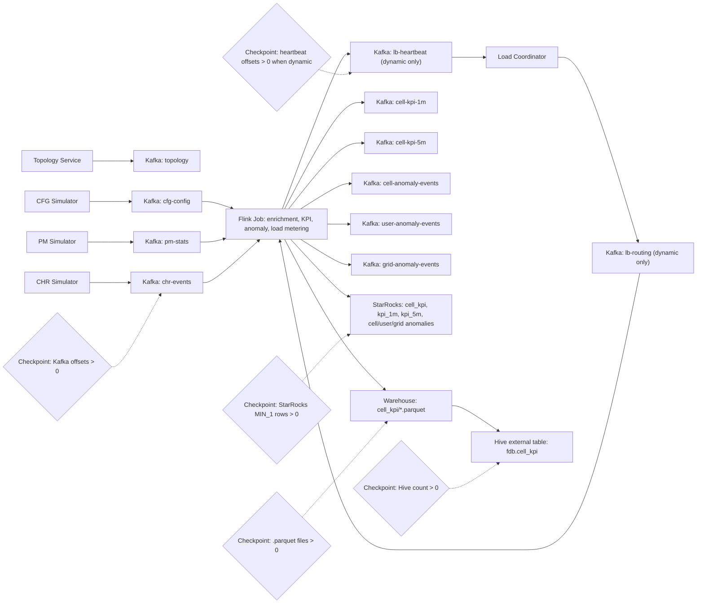

# Flink Data Balance

Local Flink demo for telecom CHR, PM and CFG streams. It publishes deterministic
cell topology, simulates Kafka traffic, enriches events in Flink, detects
anomalies, writes 1-minute and 5-minute KPIs, and demonstrates VBucket routing
decisions.

## Prerequisites

- JDK 17 with a current patch release
- Maven 3.9+
- Git Bash for scripts
- Local target: Docker Desktop plus `../shared-data-infra`
- External YARN target: Linux deployment host with Flink, Hadoop/YARN, Hive,
  Kafka and a MySQL-compatible StarRocks CLI client

## Fast Checks

```bash
mvn test
bash -n scripts/deploy.sh
docker compose -f docker/docker-compose.yml --profile e2e config
```

The Docker Compose config check is for local development and CI. On a
Docker-free external YARN deployment host, use `external-yarn check` instead.

## Deployment Targets

### Local Docker

```bash
cd ../shared-data-infra
sh scripts/infra-up.sh lakehouse lakehouse-tools streaming starrocks observability

cd ../flink-data-balance
cp .env.example.local .env.local
FDB_ENV_FILE=.env.local bash scripts/deploy.sh local check
FDB_ENV_FILE=.env.local bash scripts/deploy.sh local up
FDB_ENV_FILE=.env.local bash scripts/deploy.sh local init
FDB_ENV_FILE=.env.local bash scripts/deploy.sh local smoke
FDB_ENV_FILE=.env.local bash scripts/deploy.sh local down
```

`deploy.sh local up` starts only project runtime containers: Flink runtime,
observability API and frontend. HDFS, Hive Metastore, HiveServer2, ZooKeeper,
Kafka, StarRocks and Prometheus come from `../shared-data-infra`. Kafka uses the
shared default endpoint `kafka:9092` inside Docker and `localhost:9092` from the
host. Kafka UI is provided by the shared `observability` profile at
http://localhost:8080, and shared Prometheus is at http://localhost:19090.
`deploy.sh local init` expects the shared `lakehouse`, `lakehouse-tools`,
`streaming`, `starrocks` and `observability` profiles to be running; it creates
Kafka topics, initializes StarRocks/Hive objects, prepares HDFS directories, and
downloads the Flink Hadoop runtime jar into the ignored `docker/lib` cache.

### External YARN

External YARN mode is for Linux deployment hosts without Docker. External
Kafka, HDFS, Hive, StarRocks and YARN are expected to be provisioned already.
Install JDK 17, Maven, Flink, Hadoop/YARN clients, Hive beeline, Kafka CLI and
a MySQL-compatible StarRocks client on the deployment host, then configure
endpoints in `.env.external`.

```bash
cp .env.example.external-yarn .env.external
FDB_ENV_FILE=.env.external bash scripts/deploy.sh external-yarn check
FDB_ENV_FILE=.env.external bash scripts/deploy.sh external-yarn check --strict
FDB_ENV_FILE=.env.external bash scripts/deploy.sh external-yarn init
FDB_ENV_FILE=.env.external bash scripts/deploy.sh external-yarn submit
FDB_ENV_FILE=.env.external bash scripts/deploy.sh external-yarn smoke
FDB_ENV_FILE=.env.external bash scripts/deploy.sh external-yarn stop
```

`external-yarn check` is diagnostic by default and can be run before the target
cluster exists. Use `--strict` on the real deployment host when missing CLI tools
or endpoint failures should block deployment. `external-yarn init` prepares
Kafka topics, HDFS directories, Hive objects and StarRocks DDL; it does not
submit the Flink job. `external-yarn submit` is the explicit
operator action that builds the jar and submits it through `$FLINK_HOME/bin/flink`.

By default, `external-yarn submit` does not pass `FDB_STARROCKS_PASSWORD` through
Flink CLI arguments because those values can appear in process listings and
YARN metadata. Prefer cluster-side secret injection. If that is not available,
set `FDB_FLINK_SECRET_ENV_KEYS=FDB_STARROCKS_PASSWORD` only after accepting that
tradeoff. For complex Flink arguments, use `FDB_FLINK_EXTRA_ARGS_FILE` with one
argument per line.

## Sink Benchmarking

Set `FDB_RESULT_SINK=starrocks|iceberg|hive|kafka|none` before submit to choose
one business result sink for a run. Only one result sink is active at a time for
benchmark comparability; DLQ output is controlled independently by
`FDB_DLQ_ENABLED=true|false`.

The selected result sink applies to KPI 1m, KPI 5m, cell anomalies, user
anomalies and grid anomalies as one unit. Metrics and DLQ are separate
observability/safety paths, so `FDB_RESULT_SINK=none` disables only business
result output while keeping the calculation pipeline and optional metrics path
available.

Local submit/report:

```bash
FDB_ENV_FILE=.env.local bash scripts/deploy.sh local submit
FDB_ENV_FILE=.env.local bash scripts/deploy.sh local report
```

External YARN submit/report:

```bash
FDB_ENV_FILE=.env.external bash scripts/deploy.sh external-yarn submit
FDB_ENV_FILE=.env.external bash scripts/deploy.sh external-yarn report
```

Benchmark runner:

```bash
mvn -pl benchmark-runner -am package
FDB_ENV_FILE=.env.local bash scripts/benchmark.sh local
FDB_ENV_FILE=.env.external bash scripts/benchmark.sh external-yarn
```

For a local dry run that only validates matrix expansion and report generation:

```bash
FDB_ENV_FILE=.env.local bash scripts/benchmark.sh local --dry-run
```

The runner expands a `sink x cellLevel` matrix. For each run it sets a distinct
`FDB_RUN_ID`, `FDB_RUN_LABEL` and `FDB_RESULT_SINK`, calls the target-specific
`scripts/deploy.sh <target> prepare/submit/stop`, starts the local topology and
simulator processes with `FDB_SITES_COUNT`, `FDB_RATE_EPS` and
`FDB_PM_EPS_PER_CELL`, observes Flink REST plus the observability API, and stops
higher pressure levels for a sink after the first unstable or failed run.

`FDB_CHR_PRODUCER_THREADS` controls CHR producer worker threads inside the same
simulator process. `FDB_RATE_EPS` remains the global CHR target EPS; worker
threads split that target evenly and each worker uses its own Kafka producer.

`cellLevel` 表示本轮目标生成小区数，不再乘站点数或每站小区估算。
`Target CHR EPS = FDB_BENCHMARK_CHR_EPS_PER_CELL`，表示每小区每秒 CHR 目标输出记录数。
全局 CHR EPS 使用 `Global CHR EPS = cellLevel * Target CHR EPS` 计算，并通过
`FDB_RATE_EPS` 传给 CHR 模拟器。

`Target PM EPS = FDB_BENCHMARK_PM_EPS_PER_CELL`，表示每小区每秒 PM 目标输出记录数。
全局 PM EPS 使用 `Global PM EPS = cellLevel * Target PM EPS` 计算。

`prepare` resets benchmark data before each run. For local runs it recreates the
benchmark Kafka topics, truncates StarRocks result tables, and clears/recreates
the Hive/Iceberg HDFS output paths. The external-yarn target exposes the same
hook through external Kafka/HDFS/StarRocks commands.

Each `submit` generates `FDB_RUN_ID=run-<UTC timestamp>` when it is not already
set, passes that value into the Flink runtime, and writes the current run state
to `logs/local-current.env` or `logs/external-yarn-current.env`. You can also set
`FDB_RUN_ID` manually in the env file or command environment when rerunning a
known benchmark label. In benchmark-runner mode, the per-run id is generated
from the benchmark id, sink, cell count and CHR EPS per cell.

The runner writes static HTML and machine-readable artifacts under:

```text
benchmark-runner/output/benchmark-runs/<benchmarkId>/
```

Open `index.html` for the batch summary and follow per-run links to
`runs/<runId>/report.html`. 报告交付为 HTML-only：单轮页直接展示 Run Summary、
Source Density、Latency、Source Backlog 和 Checkpoint 信息；没有 latency 样本时显示
`N/A`。The same directory also contains `benchmark-config.json`,
`benchmark-results.json` and `benchmark-summary.csv` for machine-readable
analysis.
Each run directory contains `run.json`, `flink-snapshot.json`,
`fdb-metrics-snapshot.json`, `storage-snapshot.json` and
`topology-metrics.json`.

单轮报告中的 `Published Topology Records` 是 topology-service 发布的小区拓扑
记录数，通常等于 `cellLevel`；它不是 CHR/PM 事件生产量。CHR/PM 的事件量以
`Source Density` 和 `source-metrics.json` 为准。

The single-run report shows topology-service generation/publish metrics,
operator throughput rates from Flink's per-vertex metrics API, and separate
operator `Records In/Out Total` columns from Flink cumulative counters.

When `FDB_METRICS_HISTORY_ENABLED=true`, observability-api appends sampled
runtime metrics to `metrics.jsonl` under the same run directory. The report is
derived from that local history file, not from the selected business result
sink, so report generation does not add write load to the sink being measured.

The default checkpoint interval is `FDB_FLINK_CHECKPOINT_INTERVAL_MS=30000`.
Hive and Iceberg writers have an effective cap of 180s. For sink benchmarking,
adjust the interval per sink only when the sink needs it, and do not set it below
or far below 30s unless you are intentionally testing checkpoint pressure.

Benchmark-specific environment variables:

| Variable | Default | Description |
|---|---:|---|
| `FDB_BENCHMARK_SINKS` | `none starrocks kafka hive iceberg` | Space- or comma-separated sink list: `starrocks`, `iceberg`, `hive`, `kafka`, `none` |
| `FDB_BENCHMARK_CELL_LEVELS` | `10000 20000 40000` | Space- or comma-separated cell-count pressure levels |
| `FDB_BENCHMARK_CHR_EPS_PER_CELL` | `30` | Target CHR EPS，每小区每秒生成的 CHR 条数；Global CHR EPS = `cellLevel * FDB_BENCHMARK_CHR_EPS_PER_CELL` |
| `FDB_BENCHMARK_PM_EPS_PER_CELL` | `1` | Target PM EPS，每小区每秒生成的 PM 条数；Global PM EPS = `cellLevel * FDB_BENCHMARK_PM_EPS_PER_CELL` |
| `FDB_CHR_PRODUCER_THREADS` | `6` | CHR simulator 单进程内 producer worker 线程数；`FDB_RATE_EPS` 是全局目标，各线程均分 |
| `FDB_BENCHMARK_ANOMALY_INJECTION_RATIO` | `0.05` | Ratio of generated cells/users assigned to deterministic anomaly cohorts; anomalous CHR records also converge to stable geohash6 hotspots for grid coverage-hole output |
| `FDB_BENCHMARK_WARMUP_SEC` | `60` | Warmup time after submit and before measurement |
| `FDB_BENCHMARK_DURATION_SEC` | `300` | Measurement time before stop/report |
| `FDB_BENCHMARK_POLL_INTERVAL_SEC` | `10` | Intended observation poll interval for benchmark sampling |
| `FDB_BENCHMARK_ID` | generated | Output directory name for the benchmark batch |
| `FDB_BENCHMARK_MAX_BACKPRESSURE_RATIO` | `0.2` | Marks a run unstable when Flink backpressure ratio exceeds this value |
| `FDB_BENCHMARK_MAX_CHECKPOINT_DURATION_MS` | `120000` | Marks a run unstable when checkpoint duration exceeds this value |
| `FDB_BENCHMARK_MAX_CONSECUTIVE_CHECKPOINT_FAILURES` | `2` | Marks a run unstable after consecutive checkpoint failures |
| `FDB_BENCHMARK_MAX_KPI_AVAILABILITY_P95_MS` | `180000` | Marks a run unstable when KPI 1m/5m p95 exceeds this value |
| `FDB_BENCHMARK_MAX_SINK_P95_MS` | `180000` | Marks a run unstable when sink write p95 exceeds this value |
| `FDB_BENCHMARK_MAX_WATERMARK_LAG_MS` | `180000` | Marks a run unstable when watermark lag exceeds this value |
| `FDB_BENCHMARK_MIN_PRODUCER_DELIVERY_RATIO` | `0.98` | Marks a run unstable when source throughput attainment falls below this ratio |
| `FDB_BENCHMARK_MAX_SOURCE_BACKLOG_RECORDS` | `0` | Marks a run unstable when source backlog exceeds this record threshold |

## 实时观测控制台

The local observability stack adds an embedded frontend console, a lightweight
Java observability API and Prometheus scraping.

- Frontend: http://localhost:5173
- Observability API: http://localhost:18080
- Prometheus: http://localhost:19090

Build the API jar before starting the console services:

```bash
mvn -pl observability-api package
FDB_ENV_FILE=.env.local bash scripts/deploy.sh local up
```

The console shows CHR/PM/CFG source delay, streaming stage status, VBucket
rebalance events, and StarRocks/Hive/Iceberg sink write performance summaries.

Runtime metrics flow through Kafka before Prometheus scrapes them:

```text
Flink/source stages -> fdb-stage-metrics topic -> observability-api /metrics -> Prometheus/frontend
```

The Flink job emits samples for `chr-source`, `pm-source`, `cfg-source`, `kafka`,
`enrichment`, `kpi-1m`, `kpi-5m` and the sink probe stages
`kafka-kpi-1m`, `starrocks-kpi-1m`, `hive-kpi-1m`, `iceberg-kpi-1m`,
`kafka-kpi-5m`, `starrocks-kpi-5m`, `hive-kpi-5m`, `iceberg-kpi-5m`,
`kafka-cell-anomaly`,
`kafka-user-anomaly`, `kafka-grid-anomaly`, `starrocks-cell-anomaly`,
`starrocks-user-anomaly`, `starrocks-grid-anomaly`, `hive-cell-anomaly`,
`hive-user-anomaly`, `hive-grid-anomaly`, `iceberg-cell-anomaly`,
`iceberg-user-anomaly` and `iceberg-grid-anomaly`.
When `FDB_DYNAMIC_BALANCING_ENABLED=true`, it also emits `assigner` and
`load-coordinator` samples. The observability API keeps the latest sample per
stage and renders the `fdb_*` Prometheus series. The Flink containers also
enable the Flink Prometheus reporter on port `9249` for native
JobManager/TaskManager metrics.

Latency metrics use three lightweight runtime probes:

- Source delay: `processing_time - event_time` for CHR, PM and CFG sources.
- KPI availability delay: `processing_time - CellKpi.windowEndTs` for `kpi-1m`
  and `kpi-5m`.
- Sink probe delay: `processing_time - result window end/detection time` at the
  point where the record is handed to the selected connector branch. This is a
  connector handoff/probe latency, not a backend commit or query-visible latency.

The flow overview page reads `/api/flow/runtime` and filters the graph, stage
panel and sink panel to the active known result sink. If the runtime endpoint is
temporarily unavailable, the page keeps source/stage/sink summaries visible and
falls back to an unfiltered topology instead of hiding data.

## End-to-End Smoke Test

```bash
FDB_ENV_FILE=.env.local bash scripts/deploy.sh local smoke
```

The script builds the project, starts the Docker `e2e` profile with Flink,
starts topology and simulators, submits the job, and checks shared Kafka, StarRocks,
HDFS Parquet, Iceberg and shared Hive outputs.

StarRocks result writes use the official StarRocks Flink connector and Stream
Load, not Flink JDBC inserts. The local default connector endpoints are
`FDB_STARROCKS_CONNECTOR_JDBC_URL=jdbc:mysql://starrocks-fe:9030` and
`FDB_STARROCKS_LOAD_URL=starrocks-fe:8030`; external deployments derive them
from `FDB_STARROCKS_FE_ENDPOINT` unless explicitly configured. The default
`FDB_STARROCKS_SINK_SEMANTIC=exactly-once` flushes through checkpoint
transactions, so keep `FDB_FLINK_CHECKPOINT_INTERVAL_MS` near the 30 second
default for smoke tests unless you intentionally want slower StarRocks
visibility. `FDB_STARROCKS_JDBC_URL` remains for StarRocks SQL queries from the
API and maintenance scripts.

本地压测可以通过 `FDB_STARROCKS_SINK_BUFFER_FLUSH_MAX_BYTES`、
`FDB_STARROCKS_SINK_BUFFER_FLUSH_MAX_ROWS` 和
`FDB_STARROCKS_SINK_BUFFER_FLUSH_INTERVAL_MS` 下调 StarRocks connector 单
subtask 缓冲上限，避免多个 StarRocks sink 并行写入时默认 90MB 缓冲叠加导致
TaskManager 内存峰值过高。

The local Flink containers also set explicit memory defaults:
`FDB_FLINK_TASKMANAGER_MEMORY=4096m`, `FDB_FLINK_TASKMANAGER_SLOTS=4`,
`FDB_FLINK_JOBMANAGER_MEMORY=1600m` and `FDB_FLINK_RETAINED_CHECKPOINTS=2`.
These values keep the Iceberg/Parquet writers away from the small image defaults
that can trigger `Java heap space` during longer smoke runs. For external YARN,
the same knobs are propagated as Flink `-D` arguments by `external-yarn submit`.

### Status And Pruning

Use the target-specific status command for a read-only storage snapshot:

```bash
FDB_ENV_FILE=.env.local bash scripts/deploy.sh local status
FDB_ENV_FILE=.env.external bash scripts/deploy.sh external-yarn status
```

Storage aging uses different mechanisms per backend:

| Backend | Aging mechanism |
| --- | --- |
| Kafka | Topic `retention.ms` plus `segment.ms`, configured by `FDB_*_RETENTION_MS` and `FDB_KAFKA_SEGMENT_MS` during `init` |
| StarRocks | Explicit `prune` SQL using `FDB_STARROCKS_KPI_RETENTION_MS` and `FDB_STARROCKS_ANOMALY_RETENTION_MS` |
| HDFS Parquet | Explicit `prune` removes old KPI parquet and stale `.inprogress` files by parsing `hdfs dfs -ls -R` timestamps, so it does not depend on optional `hdfs dfs -find -mtime` support |
| Iceberg | New tables keep only 20 previous metadata versions; `prune` removes orphan in-progress files and leaves referenced data files to Iceberg snapshot expiry |
| Prometheus | Shared infra Prometheus retention, currently 15 days |

Run pruning manually or from cron/systemd on the deployment host:

```bash
FDB_ENV_FILE=.env.local bash scripts/deploy.sh local prune
FDB_ENV_FILE=.env.external bash scripts/deploy.sh external-yarn prune
```

For local smoke validation the example env keeps hot Kafka and StarRocks outputs
for 1 hour and HDFS/Iceberg files for 1 day. External examples keep business
outputs longer by default.

Do not set `FDB_ICEBERG_PRUNE_DATA_FILES=1` unless snapshots have already been
expired with an Iceberg-aware engine. Deleting Iceberg parquet files by mtime can
remove files still referenced by table metadata.

Summary output is disabled by default so the smoke path avoids extra Docker,
StarRocks and Hive statistics queries and keeps the Java processes on their normal
logging path. Enable it only when you need stage-level record counts,
code-level counters and data-shape diagnostics:

```bash
FDB_ENV_FILE=.env.local FDB_E2E_SUMMARY=1 bash scripts/deploy.sh local smoke
```

To keep the e2e stack running after a successful run and inspect real metrics,
use:

```bash
FDB_ENV_FILE=.env.local FDB_E2E_KEEP_RUNNING_ON_SUCCESS=1 FDB_E2E_SUMMARY=1 bash scripts/deploy.sh local smoke
```

Before the script reports success, it verifies that `fdb-stage-metrics` has
runtime samples, `http://localhost:18080/metrics` exposes non-zero `fdb_*`
values, Prometheus can query `fdb_stage_out_eps > 0`, the default Flink DAG does
not contain `routing-assigner`, `vbucket-load-meter` or `load-coordinator`, and
`/api/results/sink-latency` contains runtime KPI samples.

Accepted truthy values are `1`, `true`, `TRUE`, `yes` and `on`.
Summary lines are printed to the console and persisted to `logs-summary.log` by
default. Override the file with `FDB_E2E_SUMMARY_FILE`:

```bash
FDB_ENV_FILE=.env.local FDB_E2E_SUMMARY=1 FDB_E2E_SUMMARY_FILE=logs/e2e-summary.log bash scripts/deploy.sh local smoke
```

### Smoke Stage Summary

When `FDB_E2E_SUMMARY=1` is set, the script prints `[summary]` lines for the
main stages:

| Stage | Summary metrics |
| --- | --- |
| Build | Maven package result |
| Infrastructure | Running container count and Kafka topic count |
| Data Generation | Topology log line count and simulator process count |
| Flink Submit | Submitted Flink JobID |
| Kafka Input | Partition count and current records for `cfg-config`, `pm-stats`, `chr-events`, KPI and anomaly topics |
| StarRocks KPI | KPI rows by `window_kind`, KPI window timestamp range, distinct `site_id/cell_id/grid_id` counts |
| StarRocks | KPI view row counts and anomaly internal table row counts |
| Flink DAG | Dynamic balancing vertex presence; absent by default |
| Load Balancing | `lb-heartbeat` and `lb-routing` records when dynamic balancing is enabled |
| Parquet KPI | `.parquet` file count, total bytes, partition count, sample partition paths |
| Iceberg KPI | Iceberg data files, metadata JSON, snapshots and partition samples |
| Hive KPI | Hive row count and repaired partition count |

With the switch enabled, Java components also emit code-level summaries as
`[summary-code]` log lines. The smoke script collects those lines into the stage
summary:

| Component | Code-level summary examples |
| --- | --- |
| `topology-service` | generated site/cell counts, configured cells-per-site range, frequency-band count, latitude/longitude ranges |
| `simulator cfg` | loaded site/cell counts, baseline CFG records, update batches and tombstones |
| `simulator pm` | PM records per 10-second window, average active users, average DL PRB usage, window timestamp range |
| `simulator chr` | loaded site/cell counts, assigned user count, configured EPS, observed published CHR events and EPS |
| `flink-job` | KPI window output counts and window timestamps, heartbeat VBucket/event/EPS summaries |

Example summary line:

```text
[summary] StarRocks KPI | distinct_site_cell_grid | 3/48/128
[summary] Data Generation | code | [summary-code] sim-chr | assigned_users | 6234
```

The three-value StarRocks feature summary is `distinct_site_id / distinct_cell_id /
distinct_grid_id`. The Parquet partition sample follows the
`window_kind=<kind>/dt=<yyyy-MM-dd>/hour=<HH>` layout.

### Data Flow



### Key Validation Checkpoints

- Kafka input and output: `cfg-config`, `pm-stats`, `chr-events`,
  `cell-kpi-1m`, `cell-kpi-5m`, `cell-anomaly-events`,
  `user-anomaly-events` and `grid-anomaly-events` are summarized; PM messages
  and the CFG baseline must be present.
- StarRocks KPI: `cell_kpi` must contain `MIN_1` and `MIN_5` rows, and
  `kpi_1m` / `kpi_5m` views are initialized for API queries.
- StarRocks anomaly tables: `cell_anomaly_events`, `user_anomaly_events` and
  `grid_anomaly_events` must be queryable. Seeded smoke data is not guaranteed
  to produce non-zero anomaly rows.
- Flink DAG: by default, the REST plan must not contain `routing-assigner`,
  `vbucket-load-meter` or `load-coordinator`.
- Sink latency: `/api/results/sink-latency` must return runtime samples for the
  expected KPI datasets; startup seed rows with `records=0` are rejected.
- Load balancing: when `FDB_DYNAMIC_BALANCING_ENABLED=true`, `lb-heartbeat`
  must have non-zero offsets.
- Flink checkpointing: completed checkpoints are required before FileSink
  commits final Parquet files.
- KPI files: shared HDFS `/warehouse/fdb/cell_kpi` and Iceberg
  `/warehouse/iceberg/<database>/cell_kpi/data` must contain `.parquet` files.
- Hive KPI: `MSCK REPAIR TABLE fdb.cell_kpi` must discover partitions, then
  `SELECT COUNT(*) FROM fdb.cell_kpi` must return rows.

If Parquet files remain as `.inprogress`, inspect Flink checkpoint failures
first. If final files exist but the smoke test cannot find them, verify the
FileSink output suffix remains `.parquet`.

The load balancing path is intentionally demo-grade: workers publish VBucket
heartbeats, the coordinator publishes versioned site routing entries at a
5-minute boundary, and workers apply broadcast route updates before load
metering. Business enrichment remains keyed by `cellId` so route changes do not
discard CFG state. General keyed-state migration is outside this version.
