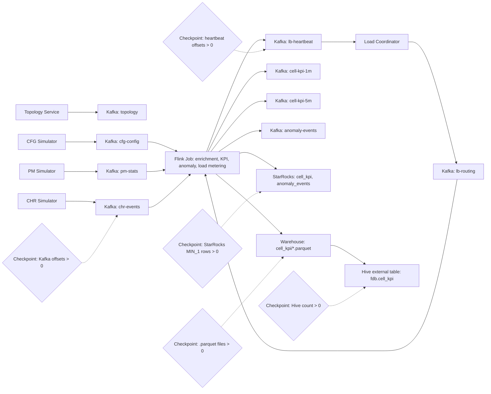

# Flink Data Balance

Local Flink demo for telecom CHR, PM and CFG streams. It publishes deterministic
cell topology, simulates Kafka traffic, enriches events in Flink, detects
anomalies, writes 1-minute and 5-minute KPIs, and demonstrates VBucket routing
decisions.

## Prerequisites

- JDK 17 with a current patch release
- Maven 3.9+
- Git Bash for scripts
- Local target: Docker Desktop plus `../shared-data-infra`
- External YARN target: Linux deployment host with Flink, Hadoop/YARN, Hive,
  Kafka and a MySQL-compatible StarRocks CLI client

## Fast Checks

```bash
mvn test
bash -n scripts/deploy.sh
docker compose -f docker/docker-compose.yml --profile e2e config
```

The Docker Compose config check is for local development and CI. On a
Docker-free external YARN deployment host, use `external-yarn check` instead.

## Deployment Targets

### Local Docker

```bash
cd ../shared-data-infra
sh scripts/infra-up.sh lakehouse lakehouse-tools streaming starrocks observability

cd ../flink-data-balance
cp .env.example.local .env.local
FDB_ENV_FILE=.env.local bash scripts/deploy.sh local check
FDB_ENV_FILE=.env.local bash scripts/deploy.sh local up
FDB_ENV_FILE=.env.local bash scripts/deploy.sh local init
FDB_ENV_FILE=.env.local bash scripts/deploy.sh local smoke
FDB_ENV_FILE=.env.local bash scripts/deploy.sh local down
```

`deploy.sh local up` starts only project runtime containers: Flink runtime,
observability API and frontend. HDFS, Hive Metastore, HiveServer2, ZooKeeper,
Kafka, StarRocks and Prometheus come from `../shared-data-infra`. Kafka uses the
shared default endpoint `kafka:9092` inside Docker and `localhost:9092` from the
host. Kafka UI is provided by the shared `observability` profile at
http://localhost:8080, and shared Prometheus is at http://localhost:19090.
`deploy.sh local init` expects the shared `lakehouse`, `lakehouse-tools`,
`streaming`, `starrocks` and `observability` profiles to be running; it creates
Kafka topics, initializes StarRocks/Hive objects, prepares HDFS directories, and
downloads the Flink Hadoop runtime jar into the ignored `docker/lib` cache.

### External YARN

External YARN mode is for Linux deployment hosts without Docker. External
Kafka, HDFS, Hive, StarRocks and YARN are expected to be provisioned already.
Install JDK 17, Maven, Flink, Hadoop/YARN clients, Hive beeline, Kafka CLI and
a MySQL-compatible StarRocks client on the deployment host, then configure
endpoints in `.env.external`.

```bash
cp .env.example.external-yarn .env.external
FDB_ENV_FILE=.env.external bash scripts/deploy.sh external-yarn check
FDB_ENV_FILE=.env.external bash scripts/deploy.sh external-yarn check --strict
FDB_ENV_FILE=.env.external bash scripts/deploy.sh external-yarn init
FDB_ENV_FILE=.env.external bash scripts/deploy.sh external-yarn submit
FDB_ENV_FILE=.env.external bash scripts/deploy.sh external-yarn smoke
FDB_ENV_FILE=.env.external bash scripts/deploy.sh external-yarn stop
```

`external-yarn check` is diagnostic by default and can be run before the target
cluster exists. Use `--strict` on the real deployment host when missing CLI tools
or endpoint failures should block deployment. `external-yarn init` prepares
Kafka topics, HDFS directories, Hive objects and StarRocks DDL; it does not
submit the Flink job. `external-yarn submit` is the explicit
operator action that builds the jar and submits it through `$FLINK_HOME/bin/flink`.

By default, `external-yarn submit` does not pass `FDB_STARROCKS_PASSWORD` through
Flink CLI arguments because those values can appear in process listings and
YARN metadata. Prefer cluster-side secret injection. If that is not available,
set `FDB_FLINK_SECRET_ENV_KEYS=FDB_STARROCKS_PASSWORD` only after accepting that
tradeoff. For complex Flink arguments, use `FDB_FLINK_EXTRA_ARGS_FILE` with one
argument per line.

## 实时观测控制台

The local observability stack adds an embedded frontend console, a lightweight
Java observability API and Prometheus scraping.

- Frontend: http://localhost:5173
- Observability API: http://localhost:18080
- Prometheus: http://localhost:19090

Build the API jar before starting the console services:

```bash
mvn -pl observability-api package
FDB_ENV_FILE=.env.local bash scripts/deploy.sh local up
```

The console shows CHR/PM/CFG source delay, streaming stage status, VBucket
rebalance events, and StarRocks/Hive/Iceberg sink write performance summaries.

Runtime metrics flow through Kafka before Prometheus scrapes them:

```text
Flink/source stages -> fdb-stage-metrics topic -> observability-api /metrics -> Prometheus/frontend
```

The Flink job emits samples for `chr-source`, `pm-source`, `cfg-source`, `kafka`,
`assigner`, `enrichment`, `load-coordinator`, `starrocks-sink`, `hive-sink` and
`iceberg-sink`. The observability API keeps the latest sample per stage and
renders the `fdb_*` Prometheus series. The Flink containers also enable the
Flink Prometheus reporter on port `9249` for native JobManager/TaskManager
metrics.

## End-to-End Smoke Test

```bash
FDB_ENV_FILE=.env.local bash scripts/deploy.sh local smoke
```

The script builds the project, starts the Docker `e2e` profile with Flink,
starts topology and simulators, submits the job, and checks shared Kafka, StarRocks,
HDFS Parquet, Iceberg and shared Hive outputs.

StarRocks receives JDBC batches from the Flink checkpoint path. Keep
`FDB_FLINK_CHECKPOINT_INTERVAL_MS` at `60000` or higher for local smoke tests
unless you also tune StarRocks compaction. The default StarRocks JDBC settings
are `FDB_STARROCKS_JDBC_BATCH_SIZE=100000`,
`FDB_STARROCKS_JDBC_BATCH_INTERVAL_MS=60000` and
`FDB_STARROCKS_JDBC_MAX_RETRIES=1` to avoid many small loads creating too many
tablet versions. Keep `rewriteBatchedStatements=true` and
`useServerPrepStmts=false` in `FDB_STARROCKS_JDBC_URL`; the job also appends
them automatically for `jdbc:mysql:` URLs when they are absent.

The local Flink containers also set explicit memory defaults:
`FDB_FLINK_TASKMANAGER_MEMORY=4096m`, `FDB_FLINK_TASKMANAGER_SLOTS=4`,
`FDB_FLINK_JOBMANAGER_MEMORY=1600m` and `FDB_FLINK_RETAINED_CHECKPOINTS=2`.
These values keep the Iceberg/Parquet writers away from the small image defaults
that can trigger `Java heap space` during longer smoke runs. For external YARN,
the same knobs are propagated as Flink `-D` arguments by `external-yarn submit`.

### Status And Pruning

Use the target-specific status command for a read-only storage snapshot:

```bash
FDB_ENV_FILE=.env.local bash scripts/deploy.sh local status
FDB_ENV_FILE=.env.external bash scripts/deploy.sh external-yarn status
```

Storage aging uses different mechanisms per backend:

| Backend | Aging mechanism |
| --- | --- |
| Kafka | Topic `retention.ms` plus `segment.ms`, configured by `FDB_*_RETENTION_MS` and `FDB_KAFKA_SEGMENT_MS` during `init` |
| StarRocks | Explicit `prune` SQL using `FDB_STARROCKS_KPI_RETENTION_MS` and `FDB_STARROCKS_ANOMALY_RETENTION_MS` |
| HDFS Parquet | Explicit `prune` removes old KPI parquet and stale `.inprogress` files by parsing `hdfs dfs -ls -R` timestamps, so it does not depend on optional `hdfs dfs -find -mtime` support |
| Iceberg | New tables keep only 20 previous metadata versions; `prune` removes orphan in-progress files and leaves referenced data files to Iceberg snapshot expiry |
| Prometheus | Shared infra Prometheus retention, currently 15 days |

Run pruning manually or from cron/systemd on the deployment host:

```bash
FDB_ENV_FILE=.env.local bash scripts/deploy.sh local prune
FDB_ENV_FILE=.env.external bash scripts/deploy.sh external-yarn prune
```

For local smoke validation the example env keeps hot Kafka and StarRocks outputs
for 1 hour and HDFS/Iceberg files for 1 day. External examples keep business
outputs longer by default.

Do not set `FDB_ICEBERG_PRUNE_DATA_FILES=1` unless snapshots have already been
expired with an Iceberg-aware engine. Deleting Iceberg parquet files by mtime can
remove files still referenced by table metadata.

Summary output is disabled by default so the smoke path avoids extra Docker,
StarRocks and Hive statistics queries and keeps the Java processes on their normal
logging path. Enable it only when you need stage-level record counts,
code-level counters and data-shape diagnostics:

```bash
FDB_ENV_FILE=.env.local FDB_E2E_SUMMARY=1 bash scripts/deploy.sh local smoke
```

To keep the e2e stack running after a successful run and inspect real metrics,
use:

```bash
FDB_ENV_FILE=.env.local FDB_E2E_KEEP_RUNNING_ON_SUCCESS=1 FDB_E2E_SUMMARY=1 bash scripts/deploy.sh local smoke
```

After the script reports success, the script verifies that `fdb-stage-metrics` has runtime samples,
`http://localhost:18080/metrics` exposes non-zero `fdb_*` values, and
Prometheus can query `fdb_stage_out_eps > 0`.

Accepted truthy values are `1`, `true`, `TRUE`, `yes` and `on`.
Summary lines are printed to the console and persisted to `logs-summary.log` by
default. Override the file with `FDB_E2E_SUMMARY_FILE`:

```bash
FDB_ENV_FILE=.env.local FDB_E2E_SUMMARY=1 FDB_E2E_SUMMARY_FILE=logs/e2e-summary.log bash scripts/deploy.sh local smoke
```

### Smoke Stage Summary

When `FDB_E2E_SUMMARY=1` is set, the script prints `[summary]` lines for the
main stages:

| Stage | Summary metrics |
| --- | --- |
| Build | Maven package result |
| Infrastructure | Running container count and Kafka topic count |
| Data Generation | Topology log line count and simulator process count |
| Flink Submit | Submitted Flink JobID |
| Kafka Input | Partition count and current records for `cfg-config`, `pm-stats`, `chr-events` |
| StarRocks KPI | KPI rows by `window_kind`, KPI window timestamp range, distinct `site_id/cell_id/grid_id` counts |
| Load Balancing | `lb-heartbeat` and `lb-routing` records, running Flink jobs, latest completed checkpoints |
| Parquet KPI | `.parquet` file count, total bytes, partition count, sample partition paths |
| Hive KPI | Hive row count and repaired partition count |

With the switch enabled, Java components also emit code-level summaries as
`[summary-code]` log lines. The smoke script collects those lines into the stage
summary:

| Component | Code-level summary examples |
| --- | --- |
| `topology-service` | generated site/cell counts, configured cells-per-site range, frequency-band count, latitude/longitude ranges |
| `simulator cfg` | loaded site/cell counts, baseline CFG records, update batches and tombstones |
| `simulator pm` | PM records per 10-second window, average active users, average DL PRB usage, window timestamp range |
| `simulator chr` | loaded site/cell counts, assigned user count, configured EPS, observed published CHR events and EPS |
| `flink-job` | KPI window output counts and window timestamps, heartbeat VBucket/event/EPS summaries |

Example summary line:

```text
[summary] StarRocks KPI | distinct_site_cell_grid | 3/48/128
[summary] Data Generation | code | [summary-code] sim-chr | assigned_users | 6234
```

The three-value StarRocks feature summary is `distinct_site_id / distinct_cell_id /
distinct_grid_id`. The Parquet partition sample follows the
`window_kind=<kind>/dt=<yyyy-MM-dd>/hour=<HH>` layout.

### Data Flow



### Key Validation Checkpoints

- Kafka input: `chr-events` must have at least one non-zero partition offset.
- StarRocks KPI: `cell_kpi` must contain `MIN_1` rows.
- Load balancing: `lb-heartbeat` must have non-zero offsets.
- Flink checkpointing: completed checkpoints are required before FileSink
  commits final Parquet files.
- Parquet KPI: shared HDFS `/warehouse/fdb/cell_kpi` must contain `.parquet` files.
- Hive KPI: `MSCK REPAIR TABLE fdb.cell_kpi` must discover partitions, then
  `SELECT COUNT(*) FROM fdb.cell_kpi` must return rows.

If Parquet files remain as `.inprogress`, inspect Flink checkpoint failures
first. If final files exist but the smoke test cannot find them, verify the
FileSink output suffix remains `.parquet`.

The load balancing path is intentionally demo-grade: workers publish VBucket
heartbeats, the coordinator publishes versioned site routing entries at a
5-minute boundary, and workers apply broadcast route updates before load
metering. Business enrichment remains keyed by `cellId` so route changes do not
discard CFG state. General keyed-state migration is outside this version.
