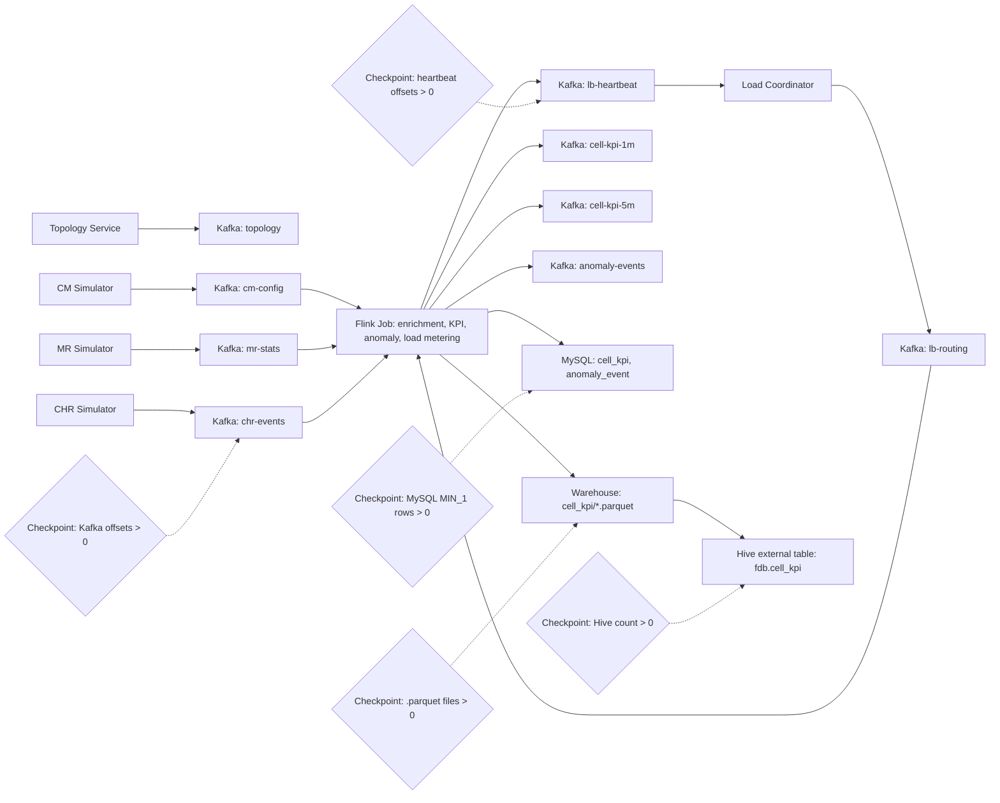

# Flink Data Balance

Local Flink demo for telecom CHR, MR and CM streams. It publishes deterministic
cell topology, simulates Kafka traffic, enriches events in Flink, detects
anomalies, writes 1-minute and 5-minute KPIs, and demonstrates VBucket routing
decisions.

## Prerequisites

- JDK 17 with a current patch release
- Maven 3.9+
- Docker Desktop
- Git Bash for scripts

## Fast Checks

```bash
mvn test
docker compose -f docker/docker-compose.yml config
```

## Infrastructure

```bash
cd ../shared-data-infra
sh scripts/infra-up.sh lakehouse lakehouse-tools streaming observability

cd ../flink-data-balance
bash scripts/dev-up.sh
bash scripts/dev-down.sh
```

`dev-up.sh` expects the shared `lakehouse`, `lakehouse-tools` and `streaming`
profiles to be running. HDFS, Hive Metastore, HiveServer2, ZooKeeper and Kafka
come from `../shared-data-infra`; this project starts only MySQL, Flink runtime,
observability API, frontend and Prometheus. Kafka uses the shared default
endpoint `kafka:9092` inside Docker and `localhost:9092` from the host.
Kafka UI is provided by the shared `observability` profile at http://localhost:8080.
It also creates Kafka topics, initializes MySQL tables, prepares shared HDFS
warehouse directories, and creates the shared Hive external table.

## 实时观测控制台

The local observability stack adds an embedded frontend console, a lightweight
Java observability API and Prometheus scraping.

- Frontend: http://localhost:5173
- Observability API: http://localhost:18080
- Prometheus: http://localhost:9090

Build the API jar before starting the console services:

```bash
mvn -pl observability-api package
docker compose -f docker/docker-compose.yml up -d observability-api frontend prometheus
```

The console shows CHR/MR/CM source delay, streaming stage status, VBucket
rebalance events, and MySQL/Hive/Iceberg sink write performance summaries.

Runtime metrics flow through Kafka before Prometheus scrapes them:

```text
Flink/source stages -> fdb-stage-metrics topic -> observability-api /metrics -> Prometheus/frontend
```

The Flink job emits samples for `chr-source`, `mr-source`, `cm-source`, `kafka`,
`assigner`, `enrichment`, `load-coordinator`, `mysql-sink`, `hive-sink` and
`iceberg-sink`. The observability API keeps the latest sample per stage and
renders the `fdb_*` Prometheus series. The Flink containers also enable the
Flink Prometheus reporter on port `9249` for native JobManager/TaskManager
metrics.

## End-to-End Smoke Test

```bash
bash scripts/e2e-smoke-test.sh
```

The script builds the project, starts the Docker `e2e` profile with Flink,
starts topology and simulators, submits the job, and checks shared Kafka, MySQL,
HDFS Parquet, Iceberg and shared Hive outputs.

Summary output is disabled by default so the smoke path avoids extra Docker,
MySQL and Hive statistics queries and keeps the Java processes on their normal
logging path. Enable it only when you need stage-level record counts,
code-level counters and data-shape diagnostics:

```bash
FDB_E2E_SUMMARY=1 bash scripts/e2e-smoke-test.sh
```

To keep the e2e stack running after a successful run and inspect real metrics,
use:

```bash
FDB_E2E_KEEP_RUNNING_ON_SUCCESS=1 FDB_E2E_SUMMARY=1 bash scripts/e2e-smoke-test.sh
```

After the script reports success, the script verifies that `fdb-stage-metrics` has runtime samples,
`http://localhost:18080/metrics` exposes non-zero `fdb_*` values, and
Prometheus can query `fdb_stage_out_eps > 0`.

Accepted truthy values are `1`, `true`, `TRUE`, `yes` and `on`.
Summary lines are printed to the console and persisted to `logs-summary.log` by
default. Override the file with `FDB_E2E_SUMMARY_FILE`:

```bash
FDB_E2E_SUMMARY=1 FDB_E2E_SUMMARY_FILE=logs/e2e-summary.log bash scripts/e2e-smoke-test.sh
```

### Smoke Stage Summary

When `FDB_E2E_SUMMARY=1` is set, the script prints `[summary]` lines for the
main stages:

| Stage | Summary metrics |
| --- | --- |
| Build | Maven package result |
| Infrastructure | Running container count and Kafka topic count |
| Data Generation | Topology log line count and simulator process count |
| Flink Submit | Submitted Flink JobID |
| Kafka Input | Partition count and current records for `cm-config`, `mr-stats`, `chr-events` |
| MySQL KPI | KPI rows by `window_kind`, KPI window timestamp range, distinct `site_id/cell_id/grid_id` counts |
| Load Balancing | `lb-heartbeat` and `lb-routing` records, running Flink jobs, latest completed checkpoints |
| Parquet KPI | `.parquet` file count, total bytes, partition count, sample partition paths |
| Hive KPI | Hive row count and repaired partition count |

With the switch enabled, Java components also emit code-level summaries as
`[summary-code]` log lines. The smoke script collects those lines into the stage
summary:

| Component | Code-level summary examples |
| --- | --- |
| `topology-service` | generated site/cell counts, configured cells-per-site range, frequency-band count, latitude/longitude ranges |
| `simulator cm` | loaded site/cell counts, baseline CM records, update batches and tombstones |
| `simulator mr` | MR records per 10-second window, average active users, average DL PRB usage, window timestamp range |
| `simulator chr` | loaded site/cell counts, assigned user count, configured EPS, observed published CHR events and EPS |
| `flink-job` | KPI window output counts and window timestamps, heartbeat VBucket/event/EPS summaries |

Example summary line:

```text
[summary] MySQL KPI | distinct_site_cell_grid | 3/48/128
[summary] Data Generation | code | [summary-code] sim-chr | assigned_users | 6234
```

The three-value MySQL feature summary is `distinct_site_id / distinct_cell_id /
distinct_grid_id`. The Parquet partition sample follows the
`window_kind=<kind>/dt=<yyyy-MM-dd>/hour=<HH>` layout.

### Data Flow



### Key Validation Checkpoints

- Kafka input: `chr-events` must have at least one non-zero partition offset.
- MySQL KPI: `cell_kpi` must contain `MIN_1` rows.
- Load balancing: `lb-heartbeat` must have non-zero offsets.
- Flink checkpointing: completed checkpoints are required before FileSink
  commits final Parquet files.
- Parquet KPI: shared HDFS `/warehouse/fdb/cell_kpi` must contain `.parquet` files.
- Hive KPI: `MSCK REPAIR TABLE fdb.cell_kpi` must discover partitions, then
  `SELECT COUNT(*) FROM fdb.cell_kpi` must return rows.

If Parquet files remain as `.inprogress`, inspect Flink checkpoint failures
first. If final files exist but the smoke test cannot find them, verify the
FileSink output suffix remains `.parquet`.

The load balancing path is intentionally demo-grade: workers publish VBucket
heartbeats, the coordinator publishes versioned site routing entries at a
5-minute boundary, and workers apply broadcast route updates before load
metering. Business enrichment remains keyed by `cellId` so route changes do not
discard CM state. General keyed-state migration is outside this version.
