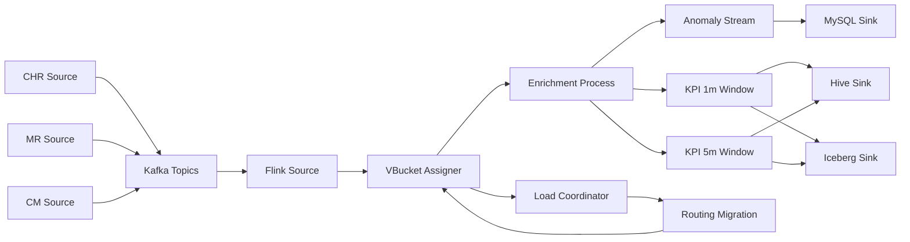

# Flink 数据均衡处理工程 — 设计文档

- **创建日期**: 2026-04-29
- **状态**: 待评审
- **关键技术栈**: Java 21 · Flink 1.20 · Maven · Avro · Kafka · MySQL · Hive (HMS) · Iceberg · React 18 · TypeScript · Vite · Ant Design · AntV G6 · Prometheus

---

## 1. 目标与非目标

### 1.1 目标

构建一个 Flink 工程，处理基站小区产生的用户级 CHR 数据，并结合**话统数据 (MR)** 与**配置数据 (CM)** 做实时分析。核心交付：

1. **三个数据源的模拟器**（合并为单 jar 多模式）：CHR、MR、CM
2. **主拓扑发布服务**：发布站点/小区拓扑，所有模拟器订阅
3. **Flink 作业**：完成 CHR + MR + CM 的实时关联，输出
   - 用户级**异常事件**（通过规则集检测）
   - 小区级 **KPI 聚合**（参数化窗口，默认 1 分钟 + 5 分钟）
4. **负载均衡机制**：在保留"同站点亲和"前提下，应对静态、时段漂移、突发热点叠加的负载倾斜
5. **状态管理**：周期性导出/加载，支撑重平衡迁移与长周期持久化
6. **下游 Sink**：MySQL（主路径）+ Hive Parquet + Iceberg KPI 并行写入与性能对比；StarRocks 作为预留扩展
7. **实时观测控制台**：用流程图展示 CHR/MR/CM → Kafka → Flink → 负载均衡 → Sink 全链路状态，并通过 SSE、观测 API、Prometheus 和前端指标页呈现吞吐、时延、迁移和写入性能
8. **本地开发环境**：Windows + Git Bash + Docker Desktop，端到端可跑

### 1.2 非目标

- 不实现完整的 5G/6G 协议栈，CHR/MR/CM 字段语义贴近真实电信场景但不强制工业标准
- 不引入 Confluent Schema Registry（schema 通过 jar 包同步）
- 不实现真实的 K8s/YARN 部署清单（项目结构预留，但本期只覆盖本地开发）
- 不实现 ML 模型类异常检测（只做规则集，留作扩展）
- 不把 Iceberg 作为 Hive 的替换方案；本阶段不新增 REST/Hive Catalog、Spark/Trino 查询验证、对象存储、Iceberg upsert/delete、compaction、snapshot cleanup 或生产级 benchmark 报告
- v1 观测控制台不替代 Flink Web UI，不支持在 UI 上手动触发重平衡，不实现用户/权限/审计登录，也不提供生产级告警分派

### 1.3 关键设计原则

- **YAGNI**：先实现可证明价值的 v1，复杂能力（如显式状态搬迁、ML 异常检测）作为扩展点列出
- **小模块、清晰边界**：模拟器、拓扑服务、Flink 作业职责互不交叉
- **倾斜可观察、可调试**：路由表用 CSV 存储和导出；Prometheus 指标、观测 API 和前端指标页开箱呈现倾斜度
- **本地优先，生产可演进**：共享 Kafka、ZooKeeper、HDFS、Hive 由 `../shared-data-infra` 提供；项目侧依赖通过 external network 和环境变量接入，代码侧不写死本地路径

---

## 2. 整体架构

### 2.1 数据流总览

```
┌──────────────────┐                                    
│ topology-service │ ──┐ topology (compact)              
└──────────────────┘   │                                 
                       ▼                                 
┌──────────────────────────────────────────────────────┐
│          Kafka topology / 三流业务 topic              │
└──────────────────────────────────────────────────────┘
        ▲           ▲            ▲                       
        │           │            │                       
   ┌────────┐  ┌────────┐  ┌────────┐                   
   │simChr  │  │simMr   │  │simCm   │ (单 jar 多模式)    
   └────────┘  └────────┘  └────────┘                   
                                                         
        chr-events     mr-stats     cm-config            
            ▼              ▼            ▼                
   ┌──────────────────────────────────────────┐         
   │          Flink Job (主作业)               │         
   │                                           │         
   │  Source → VBucketAssigner (broadcast 监听)│         
   │       → keyBy(VBucketId)                  │         
   │       → EnrichmentProcessFunction (合一)  │         
   │            ├─ Anomaly (rekey cellId)      │         
   │            ├─ KPI 1m / 5m (rekey cellId)  │         
   │            └─ Heartbeat (side output)     │         
   │  Coordinator (parallelism=1)              │         
   │       reads lb-heartbeat                  │         
   │       writes lb-routing (CSV) + snapshot │         
   │  状态导出器 (5min 周期, file:// hdfs://)   │         
   └──────────────────────────────────────────┘         
            │              │            │                
            ▼              ▼            ▼                
       anomaly-events  cell-kpi-1m  cell-kpi-5m          
            │              │            │                
            └──────┬───────┴────────────┘                
                   ▼                                     
        ┌──────────┴──────────┬──────────┐
        ▼                     ▼          ▼
    MySQL Sink            Hive Sink   Iceberg Sink
    (jdbc, idempotent)    (Parquet)   (Hadoop Catalog)
                          (按 dt/window_kind/hour 分区)
                                                         
     [扩展] StarRocks Routine Load 直接消费 Kafka 输出 topic
```

### 2.2 模块划分

```
flink-data-balance/
├── pom.xml                            # parent BOM
├── common/                            # Avro schemas, POJOs, geo, kafka serde, config
├── topology-service/                  # 主拓扑发布服务 (独立 JVM)
├── simulator/                         # CHR/MR/CM 三模式合一的模拟器
├── flink-job/                         # Flink 主作业
├── frontend/                          # React 观测控制台
├── docker/                            # docker-compose: MySQL + Flink + observability + Prometheus
├── scripts/                           # 启动 / DDL / 工具脚本
└── docs/                              # 设计文档 + Hive DDL
```

---

## 3. 数据模型 (Avro)

所有 schema 位于 `common/src/main/avro/`，用 `avro-maven-plugin` 生成 SpecificRecord。

### 3.1 ChrEvent — 用户级 CHR 事件

| 字段 | 类型 | 说明 |
|---|---|---|
| `chrId` | string | UUID |
| `eventTs` | long (timestamp-millis) | 事件时间 |
| `imsi` | string | 用户标识 |
| `imei` | string? | 设备标识 |
| `siteId` / `cellId` | string | 站点 / 小区 |
| `eventType` | enum | ATTACH/DETACH/HANDOVER/DATA_SESSION/VOICE_CALL/RRC_SETUP_FAIL/SERVICE_REQUEST/PAGING |
| `ratType` | enum | LTE / NR_NSA / NR_SA / ENDC |
| `pci` | int | 物理小区 ID |
| `qci` | int? | LTE QoS 类（4G）/ 5QI（5G） |
| `tac` / `eci` | int / long | TAC / ECI |
| `mcc` / `mnc` | string | MCC/MNC |
| `arfcn` | int? | 频点号 |
| `nssaiSst` / `nssaiSd` | int? / string? | 5G 切片 |
| `bearerType` | enum? | DEFAULT/DEDICATED |
| `durationMs` | long? | 会话持续时长 |
| `bytesUp` / `bytesDown` | long? | 上下行字节 |
| `latencyMs` | float? | 端到端时延 |
| `rsrp` / `rsrq` / `sinr` | float? | 无线信号 |
| `cqi` / `mcs` | int? | 信道质量 / 调制编码 |
| `bler` | float? | 块错误率 |
| `timingAdvance` | int? | TA |
| `resultCode` | int | 0=成功，非零=失败原因 |
| `latitude` / `longitude` | double | 用户经纬度 |
| `gridId` | string? | Geohash（由 Flink 派生写入下游 schema，源端可空） |

### 3.2 MrStat — 话统记录（每小区每 10 秒一条）

| 字段 | 类型 | 说明 |
|---|---|---|
| `siteId` / `cellId` | string | |
| `windowStartTs` / `windowEndTs` | long | 10 秒窗口边界 |
| `prbUsageDl` / `prbUsageUl` | float (0–1) | 资源块使用率 |
| `activeUsers` | int | 活跃用户数 |
| `avgRsrp` / `avgRsrq` / `avgSinr` | float | |
| `avgCqi` / `avgMcs` / `avgBler` | float | |
| `throughputDlMbps` / `throughputUlMbps` | float | |
| `droppedConnections` | int | |
| `handoverSuccess` / `handoverFailure` | int | |
| `prachAttempt` / `prachFailure` | int | 随机接入计数 |
| `rrcEstabAttempt` / `rrcEstabSuccess` | int | RRC 建立 |
| `avgLatencyMs` | float | |
| `packetLossRate` | float | |
| `numerology` | int? | 5G 子载波间隔参数 |

### 3.3 CmConfig — 配置数据（按需更新）

| 字段 | 类型 | 说明 |
|---|---|---|
| `siteId` / `cellId` | string | |
| `effectiveTs` | long | 生效时间 |
| `version` | long | 单调递增 |
| `cellType` | enum | LTE / NR_NSA / NR_SA |
| `bandwidthMhz` | int | |
| `frequencyBand` / `arfcn` | string / int | |
| `maxPowerDbm` | float | |
| `azimuth` | int (0–359) | |
| `centerLat` / `centerLon` | double | 小区中心 |
| `coverageRadiusM` | int | |
| `pci` | int | |
| `tac` / `eci` | int / long | |
| `mcc` / `mnc` | string | |
| `numerology` | int? | |
| `mimoMode` | enum? | SISO / MIMO_2x2 / MIMO_4x4 / MIMO_8x8 |
| `antennaPorts` | int | |
| `nssai` | array<record{sst, sd}> | 5G 切片 |
| `tddSubFrameAssignment` | int? | TDD 子帧配置 |
| `referenceSignalPower` | float? | |
| `neighborCells` | array<string> | 邻区 |
| `tombstone` | boolean (default false) | 软删除 |

### 3.4 AnomalyEvent — 异常事件（输出）

| 字段 | 类型 | 说明 |
|---|---|---|
| `detectionTs` | long | 检测时刻 |
| `eventTs` | long | 触发的 CHR 事件时间 |
| `imsi` | string | |
| `siteId` / `cellId` | string | |
| `gridId` | string | Geohash level 7 |
| `latitude` / `longitude` | double | |
| `anomalyType` | enum | LOW_SIGNAL / ATTACH_FAILURE_BURST / HANDOVER_FAIL_PATTERN / CONFIG_MISMATCH / COVERAGE_HOLE / (扩展) |
| `severity` | enum | LOW / MEDIUM / HIGH |
| `ruleVersion` | string | 规则版本号 |
| `contextJson` | string | 触发时刻 MR/CM 关键字段快照 |

### 3.5 CellKpi — 小区级 KPI（输出）

| 字段 | 类型 | 说明 |
|---|---|---|
| `windowStartTs` / `windowEndTs` | long | |
| `windowKind` | enum | MIN_1 / MIN_5 / MIN_15 / HOUR_1（参数化） |
| `siteId` / `cellId` | string | |
| `gridId` | string | 小区中心点 Geohash |
| `numChrEvents` | long | |
| `numUsers` | long | 唯一用户数（HLL 近似） |
| `avgRsrp` / `avgSinr` | float | |
| `avgPrbUsageDl` | float | |
| `throughputDlMbpsAvg` | float | |
| `dropRate` | float | droppedConnections / totalConnections |
| `hoSuccessRate` | float | |
| `attachSuccessRate` | float | |

### 3.6 Avro <-> Hive/MySQL 兼容性约束

- 时间戳统一用 `long` (epoch ms)，避免 Avro logical type 在 Hive 旧版本兼容问题
- 不使用 Avro `map` 类型（Hive 表达不直观），改用 `array<record{key, value}>`
- 可空字段用 `union { null, T }` 且 default 为 null
- 嵌套层级 ≤ 2 层

---

## 4. Kafka Topic 全景

| Topic | 分区 | 清理 | Key | 用途 |
|---|---:|---|---|---|
| `chr-events` | 64 | delete 7d | siteId | CHR 事件主流 |
| `mr-stats` | 16 | delete 3d | siteId | 话统 10 秒打点 |
| `cm-config` | 8 | **compact** | cellId | 配置数据 |
| `topology` | 4 | **compact** | siteId | 主拓扑 |
| `lb-heartbeat` | 1 | delete 1h | subtaskId | 子任务负载心跳 |
| `lb-routing` | 1 | **compact** | siteId | 路由表（CSV value） |
| `anomaly-events` | 16 | delete 7d | cellId | 异常输出 |
| `cell-kpi-1m` | 8 | delete 3d | cellId | KPI 1 分钟 |
| `cell-kpi-5m` | 8 | delete 7d | cellId | KPI 5 分钟 |
| `chr-dlq` / `mr-dlq` / `cm-dlq` / `enrichment-late` | 各 4 | delete 7d | — | 死信 / 迟到 |

本地副本因子 = 1，分区数偏小（用于演示）；生产环境按吞吐重新规划。Topic 创建脚本 `scripts/create-kafka-topics.sh` 提供。

---

## 5. 拓扑服务 (`topology-service/`)

### 5.1 职责

- 启动时根据 `topology.yaml` 生成确定性的站点-小区拓扑
- 全量发布到 Kafka `topology` topic（compact）
- 后续可发布增量（新增/下线站点）
- 可选 HTTP `/topology` 端点供调试

### 5.2 `topology.yaml` 关键结构

```yaml
seed: 42
sites:
  count: 3000
  cellsPerSite: { min: 3, max: 9 }
  region:
    latRange: [39.7, 40.2]
    lonRange: [116.0, 116.8]
  hotZones:
    - name: zone-cbd-1
      center: [39.91, 116.40]
      radiusKm: 3
      siteWeightMultiplier: 5.0
    - name: zone-res-1
      center: [40.05, 116.30]
      radiusKm: 4
      siteWeightMultiplier: 2.5

cellDefaults:
  cellType: NR_SA
  bandwidthMhzCandidates: [20, 40, 100]
  frequencyBands: ["n78", "n41", "n28"]
  maxPowerDbm: 49.0
  numerology: 1
  mimoMode: MIMO_4x4
```

### 5.3 关键实现

- `TopologyGenerator`：基于 `seed` 派生站点位置（按热点权重做拒绝采样）、PCI/TAC/ECI/邻区
- `KafkaTopologyPublisher`：消息体 = Avro Topology record；Kafka key = siteId
- `TopologyHttpServer`（可选）：基于 jdk.httpserver，单端口暴露 GET `/topology`

---

## 6. 模拟器 (`simulator/`)

### 6.1 模式分发

```bash
java -jar simulator.jar chr --config sim-chr.yaml
java -jar simulator.jar mr  --config sim-mr.yaml
java -jar simulator.jar cm  --config sim-cm.yaml
```

`SimulatorMain` 解析子命令分发到 `ChrSimulator` / `MrSimulator` / `CmSimulator`。

### 6.2 公共能力（共享代码 `simulator/common/`）

- `TopologyClient`：消费 `topology` topic，建立本地缓存（站点/小区/经纬度/PCI/...）
- `KafkaPublisher`：Avro 序列化 + idempotent producer
- `RateController`：按目标 EPS 用 token bucket 控制发送速率

### 6.3 ChrSimulator

#### 倾斜模型（四个开关独立）

```yaml
skewProfile:
  static:    { enabled: true }                        # 来自 topology hotZones
  diurnal:                                            # 时段漂移
    enabled: true
    rushHourMultipliers:
      "07:00-09:30": 2.5
      "17:00-20:00": 3.0
      "00:00-05:00": 0.3
    geographicShift:
      cbdHotZoneNames: ["zone-cbd-1"]
      residentialHotZoneNames: ["zone-res-1"]
      cbdPeak: "10:00-18:00"
      residentialPeak: "19:00-23:00"
  burst:
    enabled: true
    events:
      - triggerRate: 0.001       # 每秒触发概率
        durationMin: [10, 30]
        radiusKm: 1.0
        siteMultiplier: [10, 50]
  noise:     { enabled: true, stdRatio: 0.15 }
```

#### 速率与生成

- 每秒为每个小区计算瞬时强度 `λ(cellId, t) = baseλ × static × diurnal × burst × noise`
- Poisson 过程生成事件
- `eventDistribution` 决定事件类型分布（DATA_SESSION 占多数）
- `userPool` 维护 IMSI 池 + 简单 random-waypoint 漂移
- `signalModel` 根据用户与小区中心的距离派生 rsrp/sinr/cqi（边缘用户信号差，更易触发异常）
- `outOfOrderMaxLagMs` 制造乱序，测试 watermark

#### 模式

- `mode: generate`：默认，按上述模型生成
- `mode: replay`：从 Avro 文件回放（参数：`replay.path`、`replay.timeScale`、`replay.loop`）
- `mode: mixed`：先回放固定一段，再切到 generate

#### Kafka 写入

- topic = `chr-events`
- **key = siteId**（让 Kafka 端就具备初步亲和）
- value = Avro binary

### 6.4 MrSimulator

- 每 10 秒为所有 cell 生成一条 `MrStat`，墙钟对齐到 10 秒整数倍
- 与 CHR 共享 `skewProfile` 计算 `λ`，把 `prbUsage / activeUsers / throughput` 设为 `λ` 的函数 + 噪声
- 滞后 1 个窗口（模拟统计延迟）
- topic = `mr-stats`，key = siteId

### 6.5 CmSimulator

- 启动时按 `topology` 全量发布 baseline `CmConfig`（`version=1`）
- 运行中按 `updates.intervalMin` 间隔随机挑 `changeRate` 比例的 cell 改一两个字段，`version++`
- 偶发 tombstone 测试软删除
- topic = `cm-config`（compact），key = cellId

---

## 7. Flink 作业 (`flink-job/`)

### 7.1 时间语义

- **Event time**，watermark 基于 CHR `eventTs`
- 策略：`forBoundedOutOfOrderness(Duration.ofSeconds(20))`（容忍 20 秒乱序）
- 空闲 source 检测：`withIdleness(Duration.ofMinutes(1))`

### 7.2 两层分桶 + Coordinator

#### L1（稳定层）：siteId → VBucketId

- `NUM_VBUCKETS = 1024`
- `VBucketId = (consistentHash(siteId) ⊕ slotShift(siteId)) mod 1024`
- `slotShift(siteId)` 默认 0；Coordinator 通过下发 `lb-routing` 修改它
- 大部分 siteId 的 L1 映射保持不变；仅热点站点收到 shift

#### L2（路由层）：VBucketId → Subtask

- 由 Flink 标准 keyBy 哈希决定 (`KeyGroupRangeAssignment`)，不去对抗框架

#### Coordinator 算子

```
┌─────────────────────────────────────────────────────┐
│ LoadCoordinator (parallelism=1)                      │
│                                                       │
│   Input 1: KafkaSource lb-heartbeat                  │
│            (subtaskId, eps, vbucketEps[N], ts)       │
│   Input 2: 自身定时器 (每 10s 评估)                    │
│                                                       │
│   State (operator state):                             │
│     - latestHeartbeats: Map<subtaskId, Heartbeat>    │
│     - currentRouting:   Map<siteId, slotShift>       │
│                                                       │
│   决策逻辑 (RebalancePolicy):                          │
│     当某 subtask EPS > 1.5× 中位数 持续 60s:           │
│       - 找出该 subtask 上 EPS top-3 的 siteId          │
│       - 为它们计算新 slotShift, 目标 = 当前最空闲 subtask│
│       - 仅在 5min 边界生效                              │
│     输出:                                              │
│       - Kafka lb-routing (CSV)                        │
│       - 文件 routing-snapshot.csv (全量, 周期写)        │
└─────────────────────────────────────────────────────┘
```

#### 路由控制流（避免 Flink DAG 内部环）

- Workers → side output → KafkaSink → topic `lb-heartbeat` → KafkaSource → Coordinator
- Coordinator → KafkaSink → topic `lb-routing` → KafkaSource (broadcast) → 所有 worker

#### routing CSV 格式

```
siteId,vbucketId,slotShift,assignedSubtask,routingVersion,decisionTs
SITE-000123,17,0,5,42,1714387200000
SITE-007890,1003,8,12,42,1714387200000
...
```

### 7.3 三流合并（envelope 模式）

```java
sealed interface InputEnvelope {
    long ts();
    int vbucketId();
}
record ChrEnv(long ts, int vb, ChrEvent payload) implements InputEnvelope {}
record MrEnv (long ts, int vb, MrStat payload)   implements InputEnvelope {}
record CmEnv (long ts, int vb, CmConfig payload) implements InputEnvelope {}

DataStream<InputEnvelope> merged = chrTagged
    .union(mrTagged, cmTagged)
    .keyBy(InputEnvelope::vbucketId);

merged.process(new EnrichmentProcessFunction()).name("enrichment");
```

### 7.4 EnrichmentProcessFunction

#### Keyed State（per VBucketId）

| State 名 | Key | 类型 | TTL | 内容 |
|---|---|---|---|---|
| `cmState` | (VBucketId, cellId) | ValueState\<CmConfig\> | 无 | 最新生效配置 |
| `mrRing` | (VBucketId, cellId) | ListState\<MrStat\> | 5min idle | 最近 6 个 10s 窗口 |
| `userCtx` | (VBucketId, imsi) | ValueState\<UserCtx\> | 30min idle | 用户最近会话上下文 |
| `bufferState` | (VBucketId, cellId) | ListState\<ChrEvent\> | 30s（最大 buffer） | CM 未到时短期缓冲；超时丢 dlq |
| `routingTable` | broadcast | MapState\<siteId, slotShift\> | 无 | 当前路由 |

#### 处理逻辑

```
processElement(env):
    switch (env):
        case ChrEnv(_, _, chr):
            cm = cmState.get((vb, chr.cellId))
            mr = mrRing.latest((vb, chr.cellId))
            if (cm == null) {
                bufferState.add(chr)               // 短期缓冲
                if (bufferAge > 30s) -> dlq
                return
            }
            enriched = enrich(chr, cm, mr)
            enriched.gridId = Geohash.encode(chr.lat, chr.lon, level=7)
            out.collect(enriched)
            
        case MrEnv(_, _, mr):
            mrRing.add((vb, mr.cellId), mr)
            mrRing.evictOldest((vb, mr.cellId))
            
        case CmEnv(_, _, cm):
            if (cm.tombstone) cmState.clear((vb, cm.cellId))
            else if (cm.version > existing.version) cmState.update((vb, cm.cellId), cm)
            // 唤醒等待 cm 的 buffered chr
            flushBuffered((vb, cm.cellId))

onTimer(heartbeatTimer, every 5s):
    payload = HeartbeatPayload(subtaskId, recentEps, vbucketEps, ts)
    sideOutput(HEARTBEAT_TAG, payload)

onTimer(snapshotTimer, every 5min boundary):
    triggerStateSnapshot(this.subtaskId)
```

### 7.5 状态周期性导出 / 加载

#### 导出（每 5 分钟边界）

```
for each VBucketId v owned by this subtask:
    cmDump   = serialize(cmState   filtered by v)
    mrDump   = serialize(mrRing    filtered by v)
    userDump = serialize(userCtx   filtered by v)
    writeAvro(<state-root>/vbucket=v/cm-state/   <ts>.avro,   cmDump)
    writeAvro(<state-root>/vbucket=v/mr-ring/    <ts>.avro,   mrDump)
    writeAvro(<state-root>/vbucket=v/user-ctx/   <ts>.avro,   userDump)
    writeMeta (<state-root>/vbucket=v/_LATEST,    <ts>)
```

- 异步执行，不阻塞主流
- 失败 metric `state.snapshot.failures`，重试 3 次

#### 加载（启动 / 重平衡时）

```
for each newly assigned VBucketId v:
    latestTs = readMeta(<state-root>/vbucket=v/_LATEST)
    if (latestTs exists):
        load cmState, mrRing, userCtx from snapshot files
    else:
        cmState ← 重读 cm-config topic from beginning (compact, 全量)
        mrRing  ← 订阅 mr-stats earliest+30s lookback (预热)
        userCtx ← 留空 (会话级状态)
```

#### 存储布局

```
<state-root>/
├── vbucket=017/
│   ├── _LATEST                    # 文本: "2026-04-29T10-30-00"
│   ├── cm-state/<ts>.avro
│   ├── mr-ring/<ts>.avro
│   └── user-ctx/<ts>.avro
└── _global/routing-snapshot.csv
```

- 保留每个 VBucket 最近 24 个快照（约 2 小时）
- `<state-root>` 可配 `file:///` `hdfs:///` `s3://`
- 周期性持久化的双重价值：(1) 重平衡迁移 (2) 长周期审计 / 离线分析

### 7.6 异常检测算子

```
EnrichedChr ─keyBy(cellId)─▶ AnomalyDetector ─▶ AnomalyEvent
```

#### v1 规则集（5 条）

| 规则 ID | 类型 | 触发条件 | severity |
|---|---|---|---|
| `LOW_SIGNAL` | 单事件 | rsrp < -110 dBm 或 sinr < -3 dB | LOW |
| `ATTACH_FAILURE_BURST` | 滑动窗口 | 同 cellId 在 1min 内 attach 失败 ≥ 10 | HIGH |
| `HANDOVER_FAIL_PATTERN` | 滑动窗口 | 同 cellId 在 5min 内 HO 失败率 > 30% | MEDIUM |
| `CONFIG_MISMATCH` | 跨数据源 | CHR 上报 PCI/TAC 与 CmConfig 不一致 | HIGH |
| `COVERAGE_HOLE` | 空间聚合 | 同 gridId 内 5min 内低信号事件 ≥ 50 | MEDIUM |

- 实现：`KeyedProcessFunction`，规则状态用 `MapState<RuleId, RuleState>`，定时器驱动滑窗
- 阈值通过配置文件 hot-reload（监控配置文件 mtime）
- `Rule` 接口：`Optional<AnomalyEvent> evaluate(EnrichedChr, KeyedState)`

### 7.7 KPI 聚合算子

```
EnrichedChr ─keyBy(cellId)─▶
   ├─ window(Tumbling 1m).aggregate(KpiAccumulator) ─▶ cell-kpi-1m
   └─ window(Tumbling 5m).aggregate(KpiAccumulator) ─▶ cell-kpi-5m
```

- `KpiAccumulator`：事件数、唯一用户数（HLL 近似，约 1.5% 误差）、avg_rsrp、avg_sinr、avg_prb_usage_dl、throughput_avg、drop_rate、ho_success_rate、attach_success_rate
- 窗口可参数化：`--kpi-windows=1m,5m,15m,1h`

### 7.8 Sink 抽象

```java
interface WarehouseSink {
    SinkFunction<AnomalyEvent> anomalySink(SinkContext ctx);
    SinkFunction<CellKpi>      kpiSink(SinkContext ctx);
}

class MysqlWarehouseSink implements WarehouseSink { ... }       // v1 主路径
class HiveWarehouseSink implements WarehouseSink { ... }        // 湖表 Parquet 路径
class IcebergKpiSink { ... }                                    // KPI 并行写入, 不替代 Hive
class StarRocksWarehouseSink implements WarehouseSink { ... }   // 骨架, 留空
```

通过配置 `warehouse.type=mysql|starrocks` 切换业务数仓主路径；Hive 与 Iceberg 用于湖表写入和本地 demo 级性能对比。Iceberg 是追加的 KPI 写入路径，不替代当前 Hive Parquet 路径。

#### MySQL Sink

- 用 `flink-connector-jdbc` 批量写入
- 唯一约束：
  - `anomaly_events`: `UNIQUE (detection_ts, site_id, cell_id, anomaly_type, imsi)`
  - `cell_kpi`: `UNIQUE (window_start_ts, window_kind, site_id, cell_id)`
- 用 `INSERT ... ON DUPLICATE KEY UPDATE` 保证幂等
- 批量大小：500 行 或 1 秒，取先到

#### Hive Sink

- 用 `flink-connector-hive` + HiveCatalog
- HMS 地址通过配置注入
- Parquet 格式 + Snappy 压缩
- 分区：
  - `anomaly_events`: `dt, hour`
  - `cell_kpi`: `dt, window_kind, hour`
- 滚动策略：每 128MB 或 5min 触发，避免小文件
- 由 Flink checkpoint 触发分区 commit
- 当前本地实现也允许通过 Flink `FileSink` 直接写共享 HDFS 上的 Hive 可读 Parquet 目录，再由 Hive `MSCK REPAIR TABLE` 发现分区；KPI 目录结构保持为：

```text
/warehouse/fdb/cell_kpi/window_kind=<kind>/dt=<yyyy-MM-dd>/hour=<HH>/*.parquet
```

Hive 外表定义位于 `docs/hive-schema.q`，共享 HDFS 数据位置为：

```text
hdfs://namenode:8020/warehouse/fdb/cell_kpi
```

#### Iceberg KPI Sink

- 目标：在同一份 `CellKpi` 输出上并行写入 Hive 可读 Parquet 目录和 Iceberg 表，便于本地冒烟中对两种湖格式写入路径做趋势观察
- 只写 KPI，不写 `AnomalyEvent`
- 使用 Iceberg Hadoop Catalog，默认 warehouse：

```text
hdfs://namenode:8020/warehouse/iceberg
```

- 默认表标识：`fdb.cell_kpi`
- 默认环境变量：

```text
FDB_ICEBERG_ENABLED=true
FDB_ICEBERG_WAREHOUSE=hdfs://namenode:8020/warehouse/iceberg
FDB_ICEBERG_CATALOG=fdb_iceberg
FDB_ICEBERG_DATABASE=fdb
FDB_ICEBERG_TABLE=cell_kpi
```

- Iceberg 表必须是 append-only 写入；本阶段不实现 upsert、overwrite、compaction、snapshot cleanup 或表维护任务
- `dt` 与 `hour` 从 `CellKpi.windowStartTs` 按 UTC 时间派生，保证和 Hive Parquet 分区口径一致
- `cellKpi1m` 与 `cellKpi5m` 两条流分别新增并行 Iceberg sink：
  - `cell-kpi-iceberg-sink`
  - `cell-kpi-5m-iceberg-sink`
- DataStream 写入使用 Iceberg sink：

```java
FlinkSink.forRowData(...).append()
```

- 因为 Iceberg sink 写入 `RowData`，需要维护 `CellKpi` 到 `RowData` 的 mapper。字段顺序必须与 Iceberg schema 保持一致：

```text
window_start_ts, window_end_ts, site_id, cell_id, grid_id,
num_chr_events, num_users,
avg_rsrp, avg_sinr, avg_prb_usage_dl, throughput_dl_mbps_avg,
drop_rate, ho_success_rate, attach_success_rate,
window_kind, dt, hour
```

- 依赖使用 Iceberg Flink runtime：

```xml
<dependency>
    <groupId>org.apache.iceberg</groupId>
    <artifactId>iceberg-flink-runtime-1.20</artifactId>
    <version>1.11.0</version>
</dependency>
```

- 如 `RowData` 转换需要 Flink Table 类型，则补充 Flink table/common 相关依赖，并优先使用 `provided` scope，避免和 Flink runtime 镜像依赖冲突

#### StarRocks（预留扩展）

- DDL 与 Routine Load 任务定义放在 `scripts/starrocks-*.sql`
- 切换 `warehouse-type=starrocks` 时，DDL 已就绪；本期不验证

---

## 8. MySQL Schema

### 8.1 anomaly_events

```sql
CREATE TABLE anomaly_events (
  id            BIGINT AUTO_INCREMENT PRIMARY KEY,
  detection_ts  BIGINT NOT NULL,
  event_ts      BIGINT NOT NULL,
  imsi          VARCHAR(32) NOT NULL,
  site_id       VARCHAR(64) NOT NULL,
  cell_id       VARCHAR(64) NOT NULL,
  grid_id       VARCHAR(16),
  latitude      DOUBLE,
  longitude     DOUBLE,
  anomaly_type  VARCHAR(32) NOT NULL,
  severity      VARCHAR(8),
  rule_version  VARCHAR(32),
  context_json  TEXT,
  UNIQUE KEY uk_anomaly (detection_ts, site_id, cell_id, anomaly_type, imsi),
  KEY idx_event_ts (event_ts),
  KEY idx_cell (cell_id, detection_ts)
) ENGINE=InnoDB CHARSET=utf8mb4;
```

### 8.2 cell_kpi

```sql
CREATE TABLE cell_kpi (
  id              BIGINT AUTO_INCREMENT PRIMARY KEY,
  window_start_ts BIGINT NOT NULL,
  window_end_ts   BIGINT NOT NULL,
  window_kind     VARCHAR(8) NOT NULL,
  site_id         VARCHAR(64) NOT NULL,
  cell_id         VARCHAR(64) NOT NULL,
  grid_id         VARCHAR(16),
  num_chr_events  BIGINT,
  num_users       BIGINT,
  avg_rsrp        FLOAT,
  avg_sinr        FLOAT,
  avg_prb_usage_dl FLOAT,
  throughput_dl_mbps_avg FLOAT,
  drop_rate       FLOAT,
  ho_success_rate FLOAT,
  attach_success_rate FLOAT,
  UNIQUE KEY uk_kpi (window_start_ts, window_kind, site_id, cell_id),
  KEY idx_cell_window (cell_id, window_kind, window_start_ts)
) ENGINE=InnoDB CHARSET=utf8mb4;
```

---

## 9. Hive / Iceberg Schema

### 9.1 Hive 外表

```sql
CREATE EXTERNAL TABLE anomaly_events (
  detection_ts  BIGINT,
  event_ts      BIGINT,
  imsi          STRING,
  site_id       STRING,
  cell_id       STRING,
  grid_id       STRING,
  latitude      DOUBLE,
  longitude     DOUBLE,
  anomaly_type  STRING,
  severity      STRING,
  rule_version  STRING,
  context_json  STRING
)
PARTITIONED BY (dt STRING, hour STRING)
STORED AS PARQUET
TBLPROPERTIES ('parquet.compression'='SNAPPY')
LOCATION '<warehouse>/anomaly_events/';

CREATE EXTERNAL TABLE cell_kpi (
  window_start_ts BIGINT,
  window_end_ts   BIGINT,
  site_id         STRING,
  cell_id         STRING,
  grid_id         STRING,
  num_chr_events  BIGINT,
  num_users       BIGINT,
  avg_rsrp        FLOAT,
  avg_sinr        FLOAT,
  avg_prb_usage_dl FLOAT,
  throughput_dl_mbps_avg FLOAT,
  drop_rate       FLOAT,
  ho_success_rate FLOAT,
  attach_success_rate FLOAT
)
PARTITIONED BY (dt STRING, window_kind STRING, hour STRING)
STORED AS PARQUET
TBLPROPERTIES ('parquet.compression'='SNAPPY')
LOCATION '<warehouse>/cell_kpi/';
```

### 9.2 Iceberg `cell_kpi`

Iceberg `fdb.cell_kpi` 与 Hive KPI 表保持同一业务口径，并显式包含分区字段，便于直接从表状态中观察写入结果：

```text
window_start_ts BIGINT
window_end_ts   BIGINT
site_id         STRING
cell_id         STRING
grid_id         STRING
num_chr_events  BIGINT
num_users       BIGINT
avg_rsrp        FLOAT
avg_sinr        FLOAT
avg_prb_usage_dl FLOAT
throughput_dl_mbps_avg FLOAT
drop_rate       FLOAT
ho_success_rate FLOAT
attach_success_rate FLOAT
window_kind     STRING
dt              STRING
hour            STRING
```

Iceberg 分区口径为 `window_kind, dt, hour`，其中 `dt/hour` 均由 `window_start_ts` 按 UTC 派生。

---

## 10. 配置管理

### 10.1 三层合并优先级

```
默认配置 (jar 内 resources/<module>-default.yaml)
   ↑ 被覆盖
yaml 文件 (启动参数 --config <path>)
   ↑ 被覆盖
环境变量 (FDB_*)
```

### 10.2 关键启动参数

| 参数 | 默认 | 说明 |
|---|---|---|
| `--kpi-windows` | `1m,5m` | 窗口列表 |
| `--rebalance-threshold` | `1.5` | 过载阈值（× 中位数） |
| `--rebalance-window` | `60s` | 过载持续判定窗口 |
| `--vbucket-count` | `1024` | VBucket 数 |
| `--state-store` | `file:///tmp/fdb-state` | 状态存储根 |
| `--warehouse-type` | `mysql` | mysql / starrocks |
| `--watermark-lag` | `20s` | 乱序容忍 |
| `--rule-config` | `rules.yaml` | 规则阈值配置 |
| `--iceberg-enabled` | `true` | 是否启用 KPI Iceberg 并行写入 |
| `--iceberg-warehouse` | `hdfs://namenode:8020/warehouse/iceberg` | Iceberg Hadoop Catalog warehouse |
| `--iceberg-catalog` | `fdb_iceberg` | Iceberg catalog 名称 |
| `--iceberg-database` | `fdb` | Iceberg database |
| `--iceberg-table` | `cell_kpi` | Iceberg KPI 表名 |

### 10.3 关键环境变量

```
FDB_KAFKA_BOOTSTRAP=localhost:9092
FDB_MYSQL_URL=jdbc:mysql://localhost:3306/fdb
FDB_MYSQL_USER=fdb / FDB_MYSQL_PASSWORD=...
FDB_HMS_URI=thrift://localhost:9083
FDB_STATE_ROOT=file:///tmp/fdb-state
FDB_HIVE_WAREHOUSE=hdfs://namenode:8020/warehouse/fdb
FDB_ICEBERG_ENABLED=true
FDB_ICEBERG_WAREHOUSE=hdfs://namenode:8020/warehouse/iceberg
FDB_ICEBERG_CATALOG=fdb_iceberg
FDB_ICEBERG_DATABASE=fdb
FDB_ICEBERG_TABLE=cell_kpi
```

---

## 11. 容错与一致性

| 组件 | 一致性 | 机制 |
|---|---|---|
| Flink Checkpoint | exactly-once | incremental RocksDB, 间隔 60s, 超时 10min, 保留 3 |
| Kafka Source | exactly-once | offset 由 checkpoint 管理 |
| Kafka Sink | exactly-once | transactional |
| MySQL Sink | at-least-once + 业务幂等 | UNIQUE KEY + ON DUPLICATE KEY UPDATE |
| Hive Sink | exactly-once (per partition) | checkpoint 触发分区 commit |
| Iceberg Sink | exactly-once (append-only) | checkpoint 触发 snapshot commit |
| 状态导出 | best-effort | 失败 metric + 重试 3 次, 不阻塞主流 |

### DLQ

- `chr-dlq` / `mr-dlq` / `cm-dlq`：序列化错误、字段非法、CM 长缺失（>30s）
- `enrichment-late`：watermark 之后到达
- 死信消息保留原始字节 + 错误原因 JSON

---

## 12. 可观测性与实时控制台

观测能力分三层：

1. Flink 作业与适配层暴露 Prometheus 指标。
2. Java 观测 API 聚合 Flink JobManager REST、Prometheus 查询结果、本地路由/迁移事件文件和 sink probe 日志。
3. React 前端用流程图实时呈现流处理各阶段状态，并通过 `/metrics` 指标页展示吞吐、延迟、迁移和 Sink 写入摘要。

### 12.1 前端控制台

新增 `frontend/` 模块，不拆成独立 data-gov 应用。前端技术栈：

| 分类 | 选择 |
|---|---|
| 前端框架 | React 18 + TypeScript + Vite |
| UI 组件 | Ant Design |
| 流程图 / DAG | AntV G6 |
| 轻量趋势图 | ECharts 或 Ant Design Charts |
| 实时状态 | SSE (`EventSource`) |
| 专业监控 | Prometheus + 观测 API 指标页 |

页面入口：

| 路由 | 页面 | 说明 |
|---|---|---|
| `/` | `FlowOverview` | 默认首页，展示实时流处理流程图和阶段摘要 |
| `/migrations` | `MigrationTimeline` | 展示负载不均衡与迁移事件时间线 |
| `/metrics` | `MetricsDashboard` | 展示 Prometheus/API 聚合后的关键指标和 Sink 写入性能 |

前端目录：

```text
frontend/
├── package.json
├── index.html
├── vite.config.ts
├── tsconfig.json
└── src/
    ├── main.tsx
    ├── App.tsx
    ├── api/
    │   └── client.ts
    ├── pages/
    │   ├── FlowOverview.tsx
    │   ├── MigrationTimeline.tsx
    │   └── MetricsDashboard.tsx
    ├── components/
    │   ├── StreamingFlowGraph.tsx
    │   ├── StageStatusPanel.tsx
    │   ├── SourceLatencyCard.tsx
    │   └── MigrationDiffPanel.tsx
    └── types/
        └── observability.ts
```

### 12.2 流处理流程图

流程图展示 CHR/MR/CM 数据源到 Kafka、Flink、负载均衡、窗口聚合、MySQL/Hive/Iceberg Sink 的完整链路：



每个阶段节点至少展示：

| 字段 | 说明 |
|---|---|
| `status` | `healthy` / `warning` / `critical` / `idle` |
| `inEps` | 输入 EPS |
| `outEps` | 输出 EPS |
| `latencyP50Ms` | p50 处理时延 |
| `latencyP95Ms` | p95 处理时延 |
| `watermarkLagMs` | watermark 滞后 |
| `dlqCount` | 最近窗口 DLQ 数 |
| `summary` | 人类可读摘要，例如“MR 滞后 2.1s，CM 正常” |
| `updatedAt` | 最近更新时间 |

状态颜色语义：

| 状态 | 颜色语义 |
|---|---|
| `healthy` | 绿色，处理正常 |
| `warning` | 橙色，时延、倾斜、DLQ 或 Sink 写入接近阈值 |
| `critical` | 红色，阶段无输出、依赖不可用或错误持续增长 |
| `idle` | 灰色，尚未启动或无数据 |

首页顶部展示 CHR/MR/CM 三张数据源卡片：

| 数据源 | 展示内容 |
|---|---|
| CHR | 输入 EPS、Kafka lag、事件时间延迟、异常事件比例 |
| MR | 输入 EPS、Kafka lag、话统更新时间、参与关联小区数 |
| CM | 输入 EPS、Kafka lag、配置版本、最近拓扑变更数 |

数据源摘要示例：

```json
{
  "source": "chr",
  "status": "healthy",
  "eps": 12800.5,
  "kafkaLag": 120,
  "eventDelayMs": 850,
  "summary": "CHR 输入稳定，事件时间延迟 850ms"
}
```

### 12.3 负载迁移可视化

当 `subtask max EPS / median EPS` 超过阈值，Coordinator 触发迁移。前端展示：

- 迁移原因：热点小区、热点站点、突发 skewProfile、持续 imbalance
- 迁移前负载分布：每个 subtask 的 EPS、vbucket 数、热点 cellId/siteId
- 迁移后目标分布：预计 EPS 与目标 subtask
- 迁移明细：被迁移 vbucket、fromSubtask、toSubtask、cell/site 摘要
- 迁移时间线：detected、planned、applied、stabilized

迁移事件模型：

```json
{
  "migrationId": "mig-20260603-001",
  "routingVersionBefore": 17,
  "routingVersionAfter": 18,
  "reason": "subtask 3 EPS 是中位数 2.4 倍",
  "status": "applied",
  "startedAt": "2026-06-03T10:12:20+08:00",
  "completedAt": "2026-06-03T10:12:42+08:00",
  "movedVbuckets": [
    {
      "vbucket": 42,
      "fromSubtask": 3,
      "toSubtask": 1,
      "estimatedEps": 1800.0,
      "hotKeys": ["cell-001", "cell-008"]
    }
  ]
}
```

### 12.4 观测 API 与 SSE

新增轻量 Java HTTP exporter，继续留在 JVM 生态内，直接读取 Flink JobManager REST、Prometheus 查询结果和本地迁移事件文件。Node/Vite dev proxy 只用于开发期代理，不承担后端聚合。

HTTP API：

| 接口 | 说明 |
|---|---|
| `GET /api/flow/topology` | 返回流程图节点和边 |
| `GET /api/flow/status` | 返回每个阶段的实时状态摘要 |
| `GET /api/flow/sources` | 返回 CHR/MR/CM 数据源摘要 |
| `GET /api/flow/migrations` | 返回最近迁移事件 |
| `GET /api/flow/sinks` | 返回 MySQL/Hive/Iceberg 写入性能摘要 |
| `GET /api/metrics/summary` | 返回首页指标总览 |
| `GET /api/events/stream` | SSE，推送阶段状态、迁移事件、Sink 性能事件 |

`stage_status` SSE 示例：

```json
{
  "type": "stage_status",
  "stageId": "enrichment",
  "status": "warning",
  "inEps": 12000.0,
  "outEps": 11890.0,
  "latencyP95Ms": 420,
  "summary": "关联处理延迟升高，p95=420ms"
}
```

`migration_event` SSE 示例：

```json
{
  "type": "migration_event",
  "migrationId": "mig-20260603-001",
  "status": "applied",
  "summary": "已将 2 个 vbucket 从 subtask-3 迁移到 subtask-1"
}
```

### 12.5 Metrics（Flink / Exporter → Prometheus）

作业内部指标：

```text
enrichment.events.{in,enriched,dlq}        counter
enrichment.cmstate.cells                    gauge
enrichment.userctx.imsi                     gauge
enrichment.buffered.waiting_cm              gauge
coordinator.subtask.eps[N]                  gauge per subtask
coordinator.subtask.imbalance               gauge (max/median)
coordinator.rebalance.count                 counter
coordinator.routing.entries.dirty           gauge
state.snapshot.{count,duration_ms,bytes}    histogram
state.snapshot.failures                     counter
kpi.window.late                             counter
anomaly.<type>.count                        counter per rule
sink.probe.<sink>.records                   counter
sink.probe.<sink>.bytes                     counter
sink.probe.<sink>.records_per_second        gauge
```

Prometheus 规范指标：

```text
fdb_source_lag_ms{source="chr|mr|cm"}
fdb_source_eps{source="chr|mr|cm"}
fdb_stage_in_eps{stage="source|assigner|enrichment|window_1m|window_5m|sink"}
fdb_stage_out_eps{stage="source|assigner|enrichment|window_1m|window_5m|sink"}
fdb_stage_latency_ms{stage="...", quantile="p50|p95|p99"}
fdb_stage_watermark_lag_ms{stage="..."}
fdb_dlq_total{source="chr|mr|cm", reason="..."}
fdb_subtask_eps{subtask="0"}
fdb_subtask_vbucket_count{subtask="0"}
fdb_subtask_imbalance_ratio
fdb_rebalance_total
fdb_rebalance_duration_ms
fdb_migrated_vbucket_total
fdb_sink_write_latency_ms{sink="mysql|hive|iceberg", window="1m|5m"}
fdb_sink_write_rows_total{sink="mysql|hive|iceberg", window="1m|5m"}
```

### 12.6 Logging

- SLF4J + logback
- INFO：路由变更、状态快照完成、规则命中样本（采样 1/100）
- INFO：Hive / Iceberg sink probe 输出 `[summary-code]` 汇总日志，便于 e2e summary 提取
- WARN：死信、迟到事件、CM 缺失
- ERROR：序列化失败、外部依赖失败

### 12.7 前端指标页

`MetricsDashboard` 直接消费观测 API 与 Prometheus 聚合结果，不再提供或嵌入外部 dashboard。开箱包含：

- CHR/MR/CM 数据源吞吐、Kafka lag、事件时间延迟
- Flink 各阶段 in/out EPS
- 阶段 p50/p95/p99 时延
- subtask 负载分布
- 倾斜度（max EPS / median EPS）与 imbalance ratio 趋势
- 负载迁移次数、迁移耗时、迁移 vbucket 数、路由表 dirty 项
- MySQL/Hive/Iceberg 写入行数与写入延迟对比
- checkpoint 耗时、失败数、最近 checkpoint 状态
- enrichment 延迟分布、KPI 窗口处理延迟、状态快照耗时与体积
- DLQ、异常事件按类型计数与 severity 分布

前端 `/metrics` 页面通过表格、状态标签和轻量趋势图展示上述内容；Prometheus 保留为 scrape 与查询后端，页面不再使用 iframe、外部 dashboard 链接或 dashboard provisioning。

### 12.8 Hive / Iceberg 性能对比打点

性能统计分两层：Job 内轻量 probe 与 e2e 汇总。

Job 内在 Hive 与 Iceberg sink 前分别增加 probe，并输出 `[summary-code]` 日志。至少统计：

- sink 名称
- records 数量
- 估算 payload bytes
- first record timestamp
- latest record timestamp
- records per second

覆盖范围：

- `hive-cell-kpi-1m`
- `hive-cell-kpi-5m`
- `iceberg-cell-kpi-1m`
- `iceberg-cell-kpi-5m`

e2e summary 新增 `Iceberg KPI` 与 `Hive/Iceberg Compare`。Hive 指标包括 Parquet 文件数、Parquet 总字节数、分区数、Hive 查询行数；Iceberg 指标包括 data file 数、data file 总字节数、partition 目录数、metadata JSON 数、snapshot 数；对比指标包括文件数、字节数、可见输出耗时与 job 内 records/sec。

该对比用于本地冒烟和趋势观察，不定义为严格 benchmark：Hive 路径衡量的是 Parquet 文件可见加 Hive repair/query，Iceberg 路径衡量的是 Iceberg snapshot commit 后的表状态。

---

## 13. 测试策略

| 层级 | 范围 | 工具 |
|---|---|---|
| Unit | 规则、Geohash、SkewModel、Avro 序列化、配置加载、ConsistentHash | JUnit5 + AssertJ |
| Component | 模拟器各模式 dry-run（不写 Kafka）、规则集 fixture 测试 | JUnit5 |
| Integration | Embedded Kafka + MiniCluster Flink，端到端少量事件 | Testcontainers + flink-test-utils |
| Skew injection | 启用 burst skewProfile，断言 Coordinator 在 N 分钟内输出新路由 | Integration |
| Replay | 录制 chr-events 文件，replay 模式回放，校验幂等性 | Integration |
| State migration | 手动触发路由变更，验证新 subtask 加载快照后处理无缝 | Integration |
| Iceberg sink | 校验 `CellKpi` 到 `RowData` 字段顺序、类型与分区字段派生 | Unit + Integration |
| Lakehouse e2e | 同时验证 Hive Parquet、Hive 查询、Iceberg metadata、Iceberg data files、summary 输出 | e2e smoke |
| Observability API | 校验 `/api/flow/*`、`/api/metrics/summary` 与 SSE 事件模型 | Unit + Integration |
| Frontend | 流程图渲染、状态变色、迁移时间线、指标页表格和状态标签 | Component + browser smoke |
| Metrics | Prometheus scrape 新增 `fdb_*` 指标，观测 API 能返回指标摘要 | e2e smoke |

---

## 14. 本地开发环境

### 14.1 平台说明

- **目标平台**：Windows 11 + Git Bash + Docker Desktop
- 已验证可行：docker-compose 在 Windows + Docker Desktop（WSL2 backend）下完全可用，Git Bash 直接调用 `docker` / `docker compose`
- Windows 路径在 docker volume bind 时使用正斜杠（`./docker/data`），避免 `C:\` 形式

### 14.2 docker-compose 服务与共享基础设施

`../shared-data-infra` 负责通用数据基础设施，本工程通过 external network `shared-data-infra` 复用，不再重复定义 ZooKeeper、Kafka、Hive Metastore、HiveServer2 或 HDFS。

共享服务：

| 服务 | 来源 | 默认端口 | 项目内访问 |
|---|---|---:|---|
| ZooKeeper | `../shared-data-infra/compose.streaming.yaml` | 2181 | Kafka 内部依赖 |
| Kafka | `../shared-data-infra/compose.streaming.yaml` | 9092 | `kafka:9092` |
| HDFS NameNode RPC | `../shared-data-infra/compose.lakehouse.yaml` | 8020 | `hdfs://namenode:8020` |
| HDFS NameNode UI | `../shared-data-infra/compose.lakehouse.yaml` | 9870 | `http://namenode:9870` |
| Hive Metastore | `../shared-data-infra/compose.lakehouse.yaml` | 9083 | `thrift://hive-metastore:9083` |
| HiveServer2 | `../shared-data-infra/compose.lakehouse.yaml` (`lakehouse-tools`) | 10000 | `jdbc:hive2://hive-server:10000/default` |

项目本地服务（`docker/docker-compose.yml`）：

| 服务 | 镜像（指示） | 端口 | 用途 |
|---|---|---:|---|
| mysql | mysql:8 | 3306 | 数仓 sink |
| jobmanager | flink | 8081 | Flink Web UI 与作业入口 |
| taskmanager | flink | - | Flink worker |
| prometheus | prom/prometheus | 9090 | scrape Flink 与观测 exporter |
| observability-api | 项目镜像 | 18080 | 聚合状态 API 与 SSE |
| frontend | Vite / Nginx | 5173 | React 观测控制台 |

基础设施边界：

- Kafka、ZooKeeper、Hive Metastore/HMS Postgres、HiveServer2 和 HDFS 下沉到 `../shared-data-infra`，使用默认端口，并通过 `shared-data-infra` 网络被本工程容器访问。
- 本工程保留 MySQL、Flink runtime、observability-api、frontend 和 Prometheus；Prometheus 只负责本项目 scrape，不提供额外 dashboard 配置。
- e2e 脚本、topic 初始化和 summary helper 通过共享 Kafka 容器执行命令，内部 bootstrap 固定为 `kafka:9092`；宿主机客户端使用 `localhost:9092`。

本地端口约定：

```text
Kafka              localhost:9092
ZooKeeper          localhost:2181
HiveServer2        localhost:10000
HDFS NameNode UI   http://localhost:9870
Flink Web UI       http://localhost:8081
Observability API  http://localhost:18080
Frontend           http://localhost:5173
Prometheus         http://localhost:9090
```

Flink JobManager 与 TaskManager 容器必须获得相同 Iceberg/Hive 配置，并写入共享 HDFS warehouse：

```text
FDB_HIVE_WAREHOUSE=hdfs://namenode:8020/warehouse/fdb
FDB_ICEBERG_WAREHOUSE=hdfs://namenode:8020/warehouse/iceberg
```

e2e 冒烟必须验证：

- Hive Parquet 文件出现
- Hive 查询仍然返回 KPI 行
- Iceberg metadata 文件出现
- Iceberg data files 出现
- summary 中包含 `Iceberg KPI`
- summary 中包含 `Hive/Iceberg Compare`
- TaskManager 日志中出现 Hive 与 Iceberg sink probe 的 `[summary-code]`

### 14.3 Native Fallback（如不便用 Docker）

- **Kafka**：可下载 Apache Kafka tar，用 `bin/windows/*.bat` 启动；或 WSL2 中本机起
- **MySQL**：MySQL 官方 Windows 安装包
- **HMS**：在 Windows 上原生跑非常困难，**强烈建议 Docker**
- **Postgres**：原生安装包亦可

### 14.4 启动流程

```bash
# 0. 起共享依赖
cd ../shared-data-infra
sh scripts/infra-up.sh lakehouse lakehouse-tools streaming
cd ../flink-data-balance

# 1. 起项目本地服务，并初始化 Kafka topic、MySQL DDL、共享 Hive 外表
./scripts/dev-up.sh

# 2. 启动应用 (顺序非强制, 但建议)
java -jar topology-service/target/topology-service.jar &
java -jar simulator/target/simulator.jar cm  --config simulator/conf/sim-cm.yaml &
java -jar simulator/target/simulator.jar mr  --config simulator/conf/sim-mr.yaml &
java -jar simulator/target/simulator.jar chr --config simulator/conf/sim-chr.yaml &
flink run flink-job/target/flink-job.jar --config flink-job/conf/job.yaml
```

---

## 15. 已知设计权衡

| 取舍 | v1 选择 | 理由 / 后续演进 |
|---|---|---|
| 状态迁移 | 经 source topic 重读 + 周期性导出快照加载 | 简单可靠；v2 可加点对点 transfer |
| 重平衡时机 | 仅 5min 边界 | 保证 KPI 窗口完整；burst 响应延迟 ≤ 5min |
| L1 调整粒度 | 仅 top-K 热点站点 | 保证 95%+ 站点映射稳定 |
| 唯一用户数 | HLL 近似 | 状态体积 vs 精度（约 1.5% 误差）的取舍 |
| Hive 写入 | flink-connector-hive | 比 FileSystem 重，但元数据天然管理 |
| Iceberg 写入 | Hadoop Catalog + append-only 并行 KPI sink | 本地 demo 对比湖格式写入路径；不引入 REST/Hive Catalog 或表维护任务 |
| Hive/Iceberg 对比 | 冒烟趋势指标 | 两条路径的可见性语义不同，不定义为严格 benchmark |
| 观测适配层 | Java HTTP exporter | 避免为轻量聚合层引入 Python/FastAPI 运行时；Node/Vite proxy 仅用于开发期代理 |
| 指标页集成 | `/metrics` 页面直接展示 API/Prometheus 指标摘要 | 避免维护外部 dashboard provisioning 和 iframe 安全策略；本项目保留 Prometheus scrape 与前端指标展示 |

### 15.1 已知验证风险

本地验证过程中已观察到一种失败形态：Iceberg Hadoop Catalog 表 metadata 创建成功，但 `data/` 目录没有出现，e2e 在等待 Iceberg data files 时超时。

后续实现必须把这个场景作为一等验证项处理，不能只以 metadata 存在作为 Iceberg 写入成功的证据。排查方向：

- Iceberg writer 是否收到 `RowData`
- Iceberg branch 是否因为类型推断或 writer 异常失败
- checkpoint 是否完成且触发 Iceberg commit
- Iceberg `RowData` 类型信息是否与 Iceberg schema 完全一致
- Hadoop Catalog / warehouse 路径在 JobManager 与 TaskManager 是否一致
- shaded jar 是否引入 Iceberg / Hadoop 运行时冲突

---

## 16. 后续扩展点

1. **StarRocks Sink 启用**：DDL 与 Routine Load 已就绪，切 `warehouse-type=starrocks`
2. **状态显式迁移（v2）**：从快照重读切到点对点 Kafka transfer
3. **热点 Key 拆分**：针对超极端单站点的补充手段（C 方案降级保护）
4. **多租户**：多 region 共享 Flink 集群，每 region 独立路由
5. **ML-based 异常检测**：统计/模型路径，与规则集并行
6. **K8s/YARN 部署清单**：完善 deploy/ 模块
7. **观测控制台交互增强**：UI 手动触发重平衡、告警分派、登录审计、跨作业对比

---

## 17. 验收标准

- [ ] 三种 simulator 在本地能各自独立运行并向 Kafka 写入 Avro 数据
- [ ] topology-service 启动后，simulator 能从 `topology` topic 拿到拓扑
- [ ] Flink 作业能持续消费三流并产出 `anomaly-events` / `cell-kpi-{1m,5m}`
- [ ] MySQL 表能看到累积写入的异常事件与 KPI
- [ ] Hive 表能查询到分区数据
- [ ] Iceberg warehouse 下同时存在 metadata 和 data files
- [ ] e2e summary 输出 Hive KPI、Iceberg KPI、Hive/Iceberg Compare 三组指标
- [ ] Flink TaskManager 日志中能看到 Hive 与 Iceberg 两类 sink probe 的 `[summary-code]`
- [ ] 启用 burst skew 后，Coordinator 能在 ≤ 5min 内输出新路由（CSV 可见）
- [ ] 手动触发路由变更后，新 subtask 通过状态加载在 ≤ 30s 内进入稳态
- [ ] `/metrics` 指标页能展示倾斜度、重平衡次数、规则命中等关键指标
- [ ] 打开 `http://localhost:5173` 能看到完整流处理流程图
- [ ] CHR/MR/CM 三个数据源卡片能显示延迟、EPS 和摘要
- [ ] 任一阶段状态异常时，流程图节点变色，并能在右侧状态面板看到原因
- [ ] 模拟热点倾斜后，`/migrations` 能展示迁移前后负载变化与 vbucket 迁移明细
- [ ] Prometheus 能 scrape 到新增 `fdb_*` 指标
- [ ] `/metrics` 指标页和 Prometheus 能展示吞吐、时延、迁移、checkpoint、DLQ、MySQL/Hive/Iceberg Sink 性能面板
- [ ] `../shared-data-infra` 能启动 Kafka/ZooKeeper/Hive/HDFS，本工程 Docker Compose 能启动前端、观测 API、Prometheus、Flink 和 MySQL
- [ ] 单元 + 集成测试通过
- [ ] `docker compose -f docker/docker-compose.yml config` 通过
- [ ] `FDB_E2E_SUMMARY=1 bash scripts/e2e-smoke-test.sh` 通过

---
