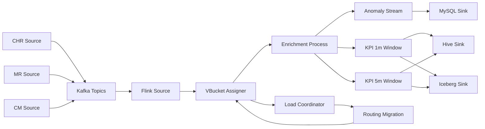

# Flink 实时流处理观测控制台 — 需求设计

> 2026-06-03 | Status: Draft

## 1. 背景

`flink-data-balance` 已具备 CHR/MR/CM 数据模拟、Kafka 接入、Flink 实时关联、负载均衡、MySQL/Hive/Iceberg Sink 与基础 Prometheus/Grafana 指标设计。现有设计文档的可观测性章节偏向指标清单和 Grafana 面板，缺少一个面向流处理运行态的可视化控制台。

本需求在当前项目内新增 `frontend/` 模块，用流程图实时呈现流处理各阶段状态，并通过 Prometheus/Grafana 展示更细粒度的吞吐、时延、负载迁移和 Sink 写入性能。

## 2. 目标

1. 用流程图展示 CHR/MR/CM 数据源到 Kafka、Flink、负载均衡、窗口聚合、MySQL/Hive/Iceberg Sink 的完整链路。
2. 实时展示每个阶段的状态、吞吐、时延、水位线滞后、摘要信息和异常原因。
3. 当发生负载不均衡时，直观看到热点 subtask、迁移前后负载变化、迁移的 vbucket 列表和路由版本变化。
4. 用 Prometheus 采集 Flink 作业与观测适配层指标，用 Grafana 提供专业监控面板。
5. 前端作为当前仓库的新增模块嵌入，不拆成独立 data-gov 应用。

## 3. 非目标

- v1 不支持在 UI 上手动触发重平衡。
- v1 不替代 Flink Web UI，只提供业务流程态势与关键指标摘要。
- v1 不要求前端直接查询 Prometheus；前端优先读取观测 API 聚合后的摘要。
- v1 不实现用户、权限、审计登录等管理能力。
- v1 不实现生产级告警分派，只预留 Grafana Alerting 配置入口。

## 4. 技术栈

前端技术栈参考 `D:\agent-code\data-gov\docs\superpowers\specs\2026-05-13-wireless-rno-data-service-design.md`：

| 分类 | 选择 |
|---|---|
| 前端框架 | React 18 + TypeScript + Vite |
| UI 组件 | Ant Design |
| 流程图 / DAG | AntV G6 |
| 轻量趋势图 | ECharts 或 Ant Design Charts |
| 实时状态 | SSE (`EventSource`) |
| 专业监控 | Prometheus + Grafana |
| 本地编排 | Docker Compose |

## 5. 页面设计

### 5.1 页面入口

新增前端路由：

| 路由 | 页面 | 说明 |
|---|---|---|
| `/` | `FlowOverview` | 默认首页，展示实时流处理流程图和阶段摘要 |
| `/migrations` | `MigrationTimeline` | 展示负载不均衡与迁移事件时间线 |
| `/metrics` | `MetricsDashboard` | 嵌入 Grafana 面板并展示关键指标入口 |

### 5.2 项目结构

```text
frontend/
├── package.json
├── index.html
├── vite.config.ts
├── tsconfig.json
└── src/
    ├── main.tsx
    ├── App.tsx
    ├── api/
    │   └── client.ts
    ├── pages/
    │   ├── FlowOverview.tsx
    │   ├── MigrationTimeline.tsx
    │   └── MetricsDashboard.tsx
    ├── components/
    │   ├── StreamingFlowGraph.tsx
    │   ├── StageStatusPanel.tsx
    │   ├── SourceLatencyCard.tsx
    │   ├── MigrationDiffPanel.tsx
    │   └── GrafanaEmbedPanel.tsx
    └── types/
        └── observability.ts
```

## 6. 流处理流程图

### 6.1 节点拓扑



### 6.2 节点状态字段

每个阶段节点至少展示：

| 字段 | 说明 |
|---|---|
| `status` | `healthy` / `warning` / `critical` / `idle` |
| `inEps` | 输入 EPS |
| `outEps` | 输出 EPS |
| `latencyP50Ms` | p50 处理时延 |
| `latencyP95Ms` | p95 处理时延 |
| `watermarkLagMs` | watermark 滞后 |
| `dlqCount` | 最近窗口 DLQ 数 |
| `summary` | 人类可读摘要，例如“MR 滞后 2.1s，CM 正常” |
| `updatedAt` | 最近更新时间 |

状态颜色：

| 状态 | 颜色语义 |
|---|---|
| `healthy` | 绿色，处理正常 |
| `warning` | 橙色，时延、倾斜、DLQ 或 Sink 写入接近阈值 |
| `critical` | 红色，阶段无输出、依赖不可用或错误持续增长 |
| `idle` | 灰色，尚未启动或无数据 |

## 7. 数据源延迟与摘要

首页顶部展示 CHR/MR/CM 三张数据源卡片：

| 数据源 | 展示内容 |
|---|---|
| CHR | 输入 EPS、Kafka lag、事件时间延迟、异常事件比例 |
| MR | 输入 EPS、Kafka lag、话统更新时间、参与关联小区数 |
| CM | 输入 EPS、Kafka lag、配置版本、最近拓扑变更数 |

数据源摘要示例：

```json
{
  "source": "chr",
  "status": "healthy",
  "eps": 12800.5,
  "kafkaLag": 120,
  "eventDelayMs": 850,
  "summary": "CHR 输入稳定，事件时间延迟 850ms"
}
```

## 8. 负载不均衡与迁移可视化

### 8.1 触发场景

当 `subtask max EPS / median EPS` 超过阈值，Coordinator 触发迁移。前端需要展示：

- 迁移原因：热点小区、热点站点、突发 skewProfile、持续 imbalance。
- 迁移前负载分布：每个 subtask 的 EPS、vbucket 数、热点 cellId/siteId。
- 迁移后目标分布：预计 EPS 与目标 subtask。
- 迁移明细：被迁移 vbucket、fromSubtask、toSubtask、cell/site 摘要。
- 迁移时间线：detected、planned、applied、stabilized。

### 8.2 迁移事件模型

```json
{
  "migrationId": "mig-20260603-001",
  "routingVersionBefore": 17,
  "routingVersionAfter": 18,
  "reason": "subtask 3 EPS 是中位数 2.4 倍",
  "status": "applied",
  "startedAt": "2026-06-03T10:12:20+08:00",
  "completedAt": "2026-06-03T10:12:42+08:00",
  "movedVbuckets": [
    {
      "vbucket": 42,
      "fromSubtask": 3,
      "toSubtask": 1,
      "estimatedEps": 1800.0,
      "hotKeys": ["cell-001", "cell-008"]
    }
  ]
}
```

## 9. 观测 API

新增轻量观测服务。实现可以是：

1. Java HTTP exporter：继续留在 JVM 生态内，直接读取 Flink JobManager REST、Prometheus 查询结果和本地迁移事件文件。
2. Node/Vite dev proxy：仅开发期代理，不承担后端聚合。

v1 推荐 Java HTTP exporter，避免为一个观测适配层引入 Python/FastAPI 运行时。

### 9.1 HTTP API

| 接口 | 说明 |
|---|---|
| `GET /api/flow/topology` | 返回流程图节点和边 |
| `GET /api/flow/status` | 返回每个阶段的实时状态摘要 |
| `GET /api/flow/sources` | 返回 CHR/MR/CM 数据源摘要 |
| `GET /api/flow/migrations` | 返回最近迁移事件 |
| `GET /api/flow/sinks` | 返回 MySQL/Hive/Iceberg 写入性能摘要 |
| `GET /api/metrics/summary` | 返回首页指标总览 |
| `GET /api/events/stream` | SSE，推送阶段状态、迁移事件、Sink 性能事件 |

### 9.2 SSE 事件

`stage_status`：

```json
{
  "type": "stage_status",
  "stageId": "enrichment",
  "status": "warning",
  "inEps": 12000.0,
  "outEps": 11890.0,
  "latencyP95Ms": 420,
  "summary": "关联处理延迟升高，p95=420ms"
}
```

`migration_event`：

```json
{
  "type": "migration_event",
  "migrationId": "mig-20260603-001",
  "status": "applied",
  "summary": "已将 2 个 vbucket 从 subtask-3 迁移到 subtask-1"
}
```

## 10. Prometheus 指标

在原有指标基础上补充以下规范指标：

```text
fdb_source_lag_ms{source="chr|mr|cm"}
fdb_source_eps{source="chr|mr|cm"}
fdb_stage_in_eps{stage="source|assigner|enrichment|window_1m|window_5m|sink"}
fdb_stage_out_eps{stage="source|assigner|enrichment|window_1m|window_5m|sink"}
fdb_stage_latency_ms{stage="...", quantile="p50|p95|p99"}
fdb_stage_watermark_lag_ms{stage="..."}
fdb_dlq_total{source="chr|mr|cm", reason="..."}
fdb_subtask_eps{subtask="0"}
fdb_subtask_vbucket_count{subtask="0"}
fdb_subtask_imbalance_ratio
fdb_rebalance_total
fdb_rebalance_duration_ms
fdb_migrated_vbucket_total
fdb_sink_write_latency_ms{sink="mysql|hive|iceberg", window="1m|5m"}
fdb_sink_write_rows_total{sink="mysql|hive|iceberg", window="1m|5m"}
```

## 11. Grafana Dashboard

新增 `docs/grafana/streaming-observability-dashboard.json`，包含：

1. CHR/MR/CM 数据源吞吐、Kafka lag、事件时间延迟。
2. Flink 各阶段 in/out EPS。
3. 阶段 p50/p95/p99 时延。
4. subtask 负载热力图。
5. imbalance ratio 趋势。
6. 负载迁移次数、迁移耗时、迁移 vbucket 数。
7. MySQL/Hive/Iceberg 写入行数与写入延迟对比。
8. checkpoint 耗时、失败数、最近 checkpoint 状态。
9. DLQ 与异常事件统计。

Grafana 页面可在 React 的 `/metrics` 页面中通过 iframe 或链接入口呈现；v1 默认使用链接或 iframe 配置开关，避免在浏览器安全策略下阻塞本地开发。

## 12. Docker Compose 集成

`docker/docker-compose.yml` 增加：

| 服务 | 默认端口 | 说明 |
|---|---:|---|
| `prometheus` | 9090 | scrape Flink、观测 exporter |
| `grafana` | 3000 | 展示 dashboard |
| `observability-api` | 18080 | 聚合状态 API 与 SSE |
| `frontend` | 5173 | Vite React 前端 |

本地端口约定：

```text
Flink Web UI       http://localhost:8081
Observability API  http://localhost:18080
Frontend           http://localhost:5173
Prometheus         http://localhost:9090
Grafana            http://localhost:3000
```

## 13. 验收标准

- 打开 `http://localhost:5173` 能看到完整流处理流程图。
- CHR/MR/CM 三个数据源卡片能显示延迟、EPS 和摘要。
- 任一阶段状态异常时，流程图节点变色，并能在右侧状态面板看到原因。
- 模拟热点倾斜后，`/migrations` 能展示迁移前后负载变化与 vbucket 迁移明细。
- Prometheus 能 scrape 到新增 `fdb_*` 指标。
- Grafana 能展示吞吐、时延、迁移、checkpoint、DLQ、MySQL/Hive/Iceberg Sink 性能面板。
- Docker Compose 能一键启动前端、观测 API、Prometheus 和 Grafana。
- 文档中明确该 Spec 与原始 Flink 数据均衡设计的关系。

## 14. 与既有 Spec 的关系

本 Spec 是 `2026-04-29-flink-data-balance-design.md` 中“12. 可观测性”的扩展设计，聚焦：

- React 前端控制台
- G6 实时流程图
- SSE 状态推送
- Prometheus 指标规范
- Grafana dashboard
- 负载迁移可视化
- MySQL/Hive/Iceberg Sink 性能对比可视化

原始 Spec 继续作为 Flink 作业、数据模型、负载均衡和本地运行环境的主设计文档。
